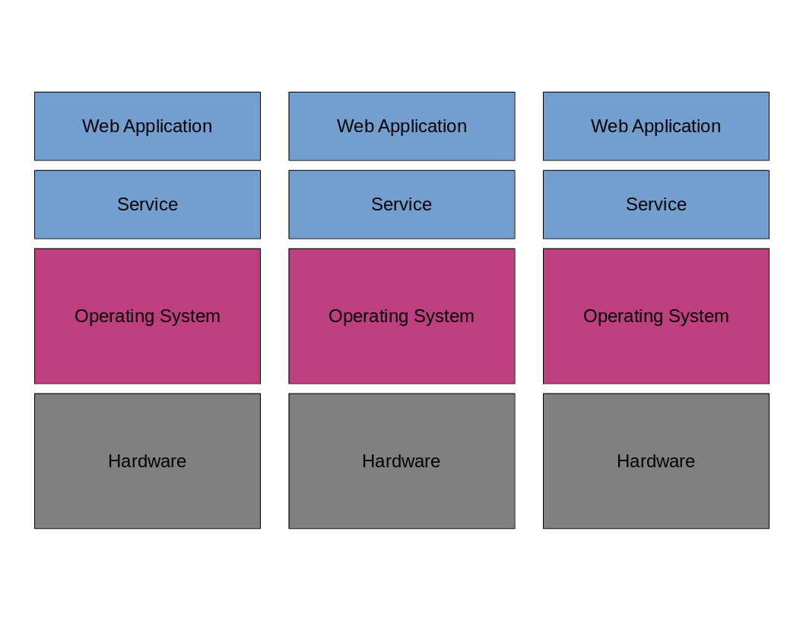
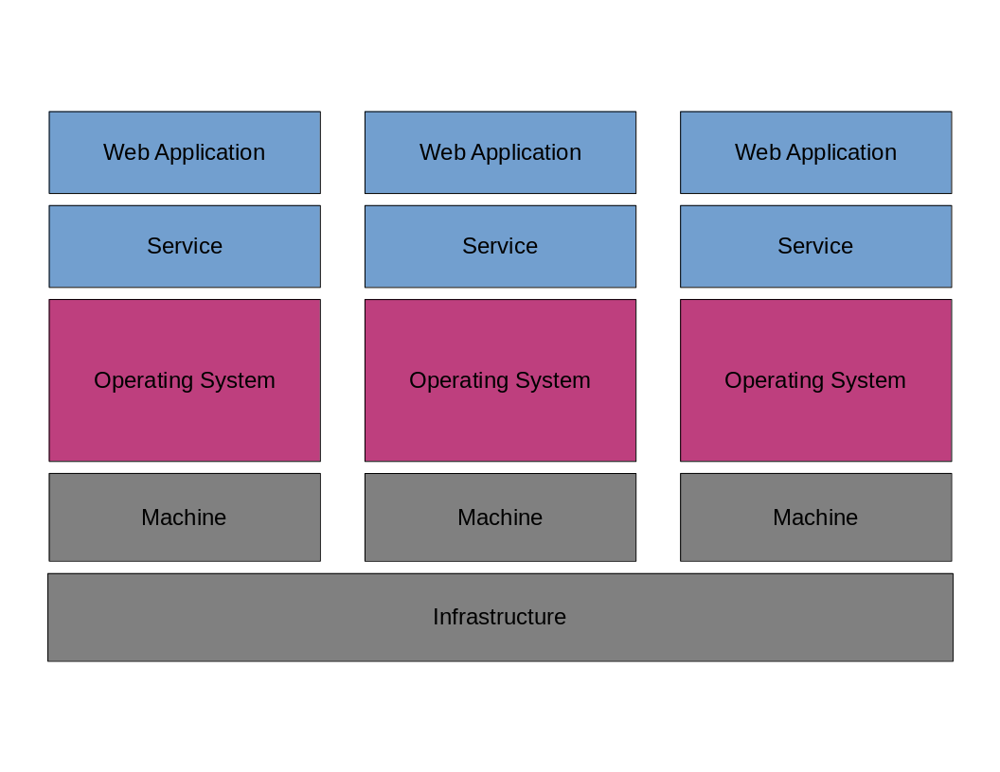
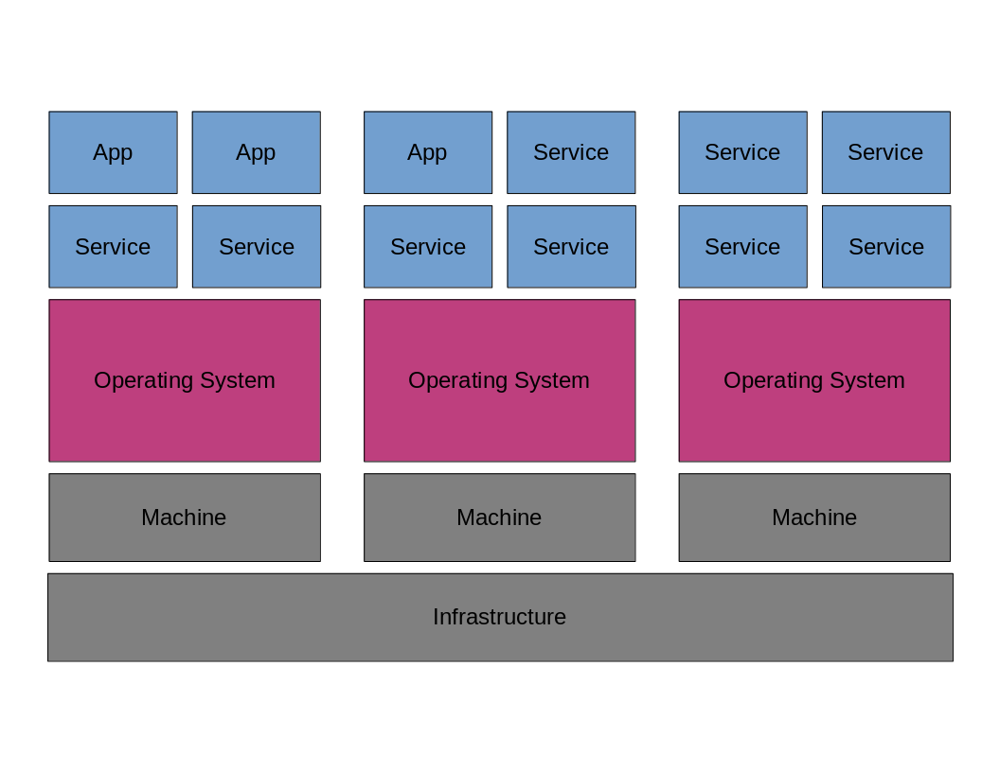
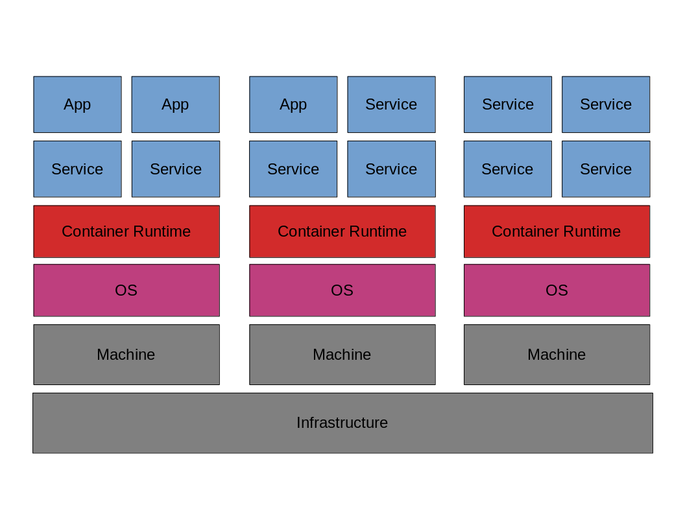
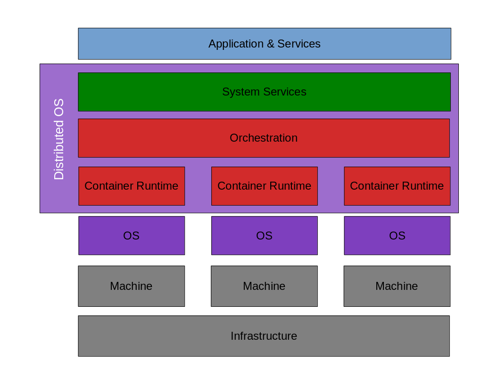
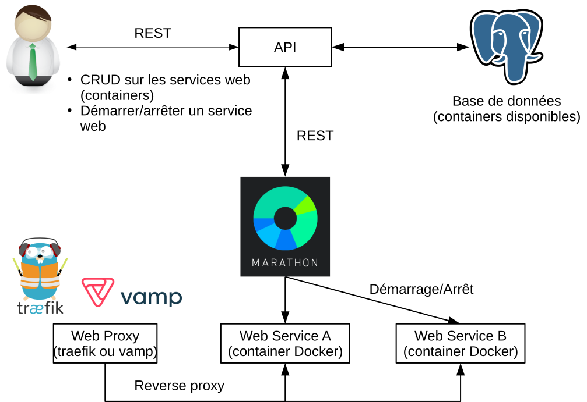

.. MIP App Framework documentation master file, created by
   sphinx-quickstart on Tue Feb  7 00:24:36 2017.
   You can adapt this file completely to your liking, but it should at least
   contain the root `toctree` directive.

Welcome to Maracker's documentation!
=============================================

.. toctree::
   :maxdepth: 2
   :numbered:
   :caption: Contents:

Introduction
============

Ce document décrit la réalisation d'une API facilitant le déploiement
d'applications dans une infrastructure de type SaaS (Software as a Service)
dans le cadre d'un travail de bachelor en collaboration avec le CHUV et
la HE-ARC.

Le CHUV participe au projet Human Brain Project qui a pour but de mettre en
place une infrastructure de recherche pour différents domaines liés à
l’étude du cerveau (neurosciences mais pas uniquement).
Ce projet est décomposé en 12 sous-projets. L’équipe de développement du CHUV
s’occupe de la réalisation du sous-projet 8 (SBP8):
Medical Informatics Platform (MIP).

Le premier but du SBP8 est de proposer divers outils permettant de mieux
comprendre les différences et similitudes entre différentes maladies
du cerveau. Ces outils permettraient de mieux classifier, diagnostiquer
et traiter ces maladies en se basant sur une grande quantité de données
médicales anonymisées.

Son deuxième but est de rendre ces outils accessibles au-travers
d’une plateforme web. Quelques applications ont déjà été développées et
intégrées à la plateforme. Cependant il n’existe pas de moyen simple de
déployer une application tierce provenant des communautés de chercheurs en
neuroscience ou statistiques dans l’infrastructure existante et de pouvoir
la gérer (démarrage, arrêt, exposition) aujourd’hui.

La plateforme MIP contient déjà une infrastructure permettant de gérer
des services encapsulés dans des containers Docker et répartis dans un cluster
de machines avec les technologies de Mesosphere (Mesos et Marathon).

.. raw:: latex

   \clearpage

Introduction aux systèmes distribués
------------------------------------

Afin de bien comprendre la problématique, il est préférable de commencer
par présenter le fonctionnement et l'intérêt des systèmes distribués.

Avant l'arrivée des applications web, l'architecture se limitait à
une couche d'application se superposant à celle du système d'exploitation
(OS) qui se superpose à l'hardware.

.. figure:: images/computer_architecture.png
   :width: 250px
   :align: center
   :alt: Architecture simple basée sur une application unique

   Architecture simple basée sur une application unique

Si on est dans le cas d'une application web, l'application peut
être une application web dite monolithique.
On dit qu'une application est monolithique lorsque elle est constituée
d'un seul bloc et que sa conception n'a pas été prévue pour la scinder
en différentes parties (front-end, back-end et éventuellement
la base de données).

Les applications devenant plus populaires, il a fallu déployer celles-ci
sur plusieurs machines de manière à ce qu'elles puissent supporter
les nombreux utilisateurs de ces applications. On parle alors de haute
disponibilité et de scaling. Les machines sont donc organisées en clusters
(groupe de machines) et un load-balancer (répartiteur de charge) permet
de répartir les requêtes des utilisateurs sur les différentes machines.

.. figure:: images/high_availability_architecture.png
   :width: 250px
   :align: center
   :alt: Architecture orientée haute disponibilité et «scalabilité»

   Architecture orientée haute disponibilité et «scalabilité»

Comme les données de certaines applications web pouvaient être également être
intéressante pour d'autres logiciels. Une nouvelle architecture a été adoptée
par les développeurs d'applications web: l'architecture orientée service
(Service Oriented Architecture) abrégée SOA.
Cette nouvelle architecture propose donner un point d'entrée pour les humains
(des interfaces graphiques) et un point d'entrée pour les machines fournissant
des données sous différents formats (:code:`JSON`, :code:`XML`, ...).
Afin d'adopter cette architecture les applications sont souvent découpée en
deux parties; une partie fournissant un front-end et l'autre étant le service.

   Architecture orientée services

Le principal inconvénient de cette architecture est que cela demande plus de
travail de la part des administrateurs système. Il y a deux
applications à maintenir mais aussi à exposer aux utilisateurs
et à sécuriser. Comme cela demande de plus en plus d'opération, il devient
nécessaire de s'abtraire du matériel et de faire du provisionning.
Cela consiste à créer
des machines virtuelles et d'en sauver leur image (snapshot) de manière
à pouvoir facilement en instancier une identique rapidement opérationnelle.
Une solution complémentaire est d'utiliser
un outils de déploiement automatisé comme *Ansible* qui s'exécute sur
la machine virtuelle et installe toutes les dépendances.
Il devient donc possible de créer des machines virtuelles à la demande.
On parle d'infrastructure lorsque plusieurs machines virtuelles sont réparties
sur plusieurs machines physiques.
C'est de là qu'est né le terme Infrastructure as a Service (IaaS).

**A restructurer pour parler d'Ansible (pour le provisionning) > bash**

**Parler de solutions de cloud computing comme OpenStack?**

**Expliquer le Iaas?**

.. raw:: latex

   \clearpage

La virtualisation est la solution qui est la plus utilisée. Donnant ainsi
une architecture représentée par le schéma ci-dessous:

   Architecture utilisant une solution de virtualisation

Il existe de nombreuses solutions de virtualisation aujourd'hui.
Certaines sont moins gourmandes en ressources que d'autres.
Les plus utilisés sont *VMWare*, *Virtualbox*, *KVM* et *libvirt*.

Si l'on désire faire du provisionning, il est possible d'utiliser
*Vagrant* en combinaison avec *Ansible*.

Cependant les utilisateurs des problèmes de réseau se posent. Comment
gérer ces machines qui peuvent être créées à la demande et
gérer leurs configurations réseau pour que les applications
qu'elles hébergent sont accessibles aux utilisateurs?
Cela requiert que les développeurs connaissent l'ensemble de la stack.
Ce qui demande un investissement supplémentaire de leur part.
Une architecture basée sur des microservices a été proposée pour éviter
ce genre de problèmes. De cette manière, il est possible de déployer
plusieurs applications sur une même machine même si les applications
ne sont pas écrites dans le même langages.

   Architecture basée microservices

.. raw:: latex

   \clearpage

Dans le schéma ci-dessus, les utilisateurs finaux utilisent les applications
et les applications utilisent les services.
Le problème de cette architecture est qu'il y un nombre important de services
à gérer. Il faut donc veiller à ce que les dépendances de chaque application
et service soit satisfaites. La solution trouvée pour résoudre ces problèmes
de dépendances a été de développer d'utiliser des containers:

   Architecture basée sur la conteneurisation de microservices

Le principe d'un container consiste à partager le noyau (kernel)
du système hôte entre plusieurs processus faisant partie de l'espace utilisateur
(user space). Ces processus sont appelé des containers. Ce sont des processus
que l'on peut considérer comme des machines virtuelles dans le sens où
dans programmes s'exécutent à l'intérieur. Chaque container est basé sur
l'image d'un système GNU/Linux. Les logiciels installés diffèrent donc
d'un container à un autre mais ils partagent tous le même noyau: celui du
système hôte.
Un container est normalement sans état (stateless) dans le sens où il ne
retrouve pas l'état dans lequel il était précédemment entre deux démarrages.
A chaque fois qu'il démarre on se retrouve avec une machine «toute neuve».
Il est possible de les rendre stateful grâce au système de volumes. Celui-ci
permet de partager des dossiers entre le système hôte et celui du container.
Dans le cas d'un container hébergeant une base de données par exemple,
un container stateful peut dumper la base de données régulièrement
dans un dossier partagé. De cette manière on garde des backups de la base de
données sur le système hôte. On peut ensuite rendre le container intelligent
pour qu'il vérifie la présence de dump dans le dossier qu'il partage avec
l'hôte. S'il y en a, il les exécute et retrouve une base de données similaire
à celle avant son redémarrage.
Comme ils partagent le même noyau, les containers sont moins gourmands en
ressources que les machines virtuelles standards. On peut donc en lancer
plusieurs sur un même système hôte. C'est d'ailleurs l'intérêt des containers.
Ils sont plus légers (on parle de 8 MB pour une image basée sur Alpine Linux)
que les machines virtuelles.
Un autre avantage des containers est qu'il est possible de créer sa propre
image. Un développeur qui crée une application peut donc créer un container
embarquant son application. La rendant ainsi plus facilement distribuable
car l'image contient toutes les dépendances requises par l'application
développée.
En principe, un container ne doit exécuter un seul processus afin que
signaux de processus (:code:`SIGINT`, :code:`SIGTERM`, etc.) envoyés de l'hôte
au container soient traités comme il faut et qu'il ne reste pas de processus
zombies.
Il existe plusieurs solutions de conteneurisation; Docker, Singularity ou encore
LXC (Linux Container). Docker est une des solutions les plus populaires et
c'est celle qui est utilisée au CHUV pour packager ses microservices.

Dans cette archictecture, le développeur n'a donc plus besoin de veiller
à ce que les dépendances soient installées sur sa machine virtuelle car
la machine virtuelle doit uniquement avoir la solution de conteneurisation
installée pour faire fonctionner son container. Les dépendances sont satisfaites
directement par l'image qui été créée par le développpeur pour son application.

L'inconvénient principal de cette architecture est que les machines virtuelles
hébergent de plus en plus de containers et que les opérateurs doivent plannifier
les déploiements de ceux-ci sur les différentes machines à disposition
(en fonction des ressources demandées par chaque container). Les déploiements
sont donc bien plus simples qu'avant mais gérer les ressources à allouer pour
chaque container manuellement devient difficile même si le noyau Linux
possède quelques fonctionnalités pour le faire.
C'est pourquoi des outils d'orchestration de containers ont été développés.
Ceux-ci permettent d'automatiser cette procédure et donc de décharger
les opérateurs de cette responsabilité.
Si on utilise un outil d'orchestration de container, l'architecture
prend alors la forme suivante:

.. figure:: images/container_orchestration_revised.png
   :width: 350px
   :align: center
   :alt: Architecture utilisant un outils d'orchestration de containers

   Architecture utilisant un outil d'orchestration de containers

L'orchestration de containers est un processus automatisé qui vise à
plannfier, coordonner et gérer les composants (containers) d'un système
complexe ainsi que les ressources qu'ils utilisent.

.. raw:: latex

    \clearpage

L'orchestration de containers consiste en trois type de tâches:

Gestion des services (Service Management):
    Ce groupe est responsable de définir ce qu'il faut faire avec
    chaque service une fois qu'il est déployé et comment en faire
    communiquer plusieurs) entre eux. La vérification de la santé du service
    est également une tâche importante de ce groupe.

Planification (Scheduling):
    Ce type de tâche regroupe les décisions à prendre en terme de nombre
    d'instances de chaque service (scaling), à quel moment le déployer,
    le mettre à jour, etc. Veiller à ce que certains services soient
    toujours déployés ensembles sur la même machine fait aussi parti
    de ce groupe de tâches.

Gestion des ressources (Resources Management):
    Les tâches de ce type consistent à veiller que les ressources (CPU, GPU,
    volumens, ports, IPs) sont consommées manière cohérente et disctribuées
    comme désiré entre les différents containers.

Dépendant du contexte d'autres fonctionnalités qui ne sont pas propres à
l'orchestration de containers comme la sécurité peuvent être exigées.

Une fois mise en place, une telle infrastructure permet de faire du PaaS
(Platform as a Service). Le Paas vise à proposer une plateforme qui permet
aux développeurs de développer, déployer, tester et gérer leurs applications
sans devoir se soucier des problèmes liés à l'infrastructure sous-jacente.
Aujourd'hui ces applications sont souvent packagées dans des containers.
Microsoft Azure est une exemple de plateforme permettant aux développeurs
de déployer leurs containers.

**Parler des changements d'habitudes du développeur? Nouvelle méthode
de développement (source --> CI/Test/Packages ---> Image Docker ---> prod)**

Finalement, en observant toutes ces couches, on peut comparer toute
cette stack à un système d'exploitation. La couche contenant les applications
et services peut s'apparenter à des processus s'exécuter dans l'espace
utilisateur.
La couche responsable de l'orchestration correspondrait à la couche de l'espace
kernel (aussi appelé system space). Les containers seraient vu comme
des microkernels et tout le reste serait dans la couche hardware.
La différence par rapport à un système d'exploitation standard est que
le système distribue toutes les tâches appartenant à l'espace utilisateur
sur différentes machines.

**Un schéma faciliterait la compréhension du paragraphe précédent**

.. raw:: latex

   \clearpage

Le principe de système distribué n'est pas récent. Des tentatives comme
:code:`Plan 9` ont été développée avant l'existence des containers.
Seulement, l'utilisation de ce type de systèmes de demandait de réécrire
complètement ses applications très souvent dans un langage de programmation
supportant la concurrence (pas forcément connu du développeur).
Les solutions d'aujourd'hui ont permis de régler ce type de problèmes en partie
grâce à la conteneurisation des applications. Il n'est maintenant plus
nécessaire de réécrire son application et les nouveaux systèmes ne sont pas
dépendants de l'OS de la machine ou du langage utilisé pour écrire
l'application.

   Système d'exploitation distribué

Même s'il est appelé *système d'exploitation*, le système distribué est plutôt
vu comme une couche se superposant à l'OS existant de la machine hôte.
Il existe de nombreuses solutions permettant de mettre en place un système
d'exploitation de manière plus ou moins complète.
Certaines comme *Docker Swarm*, *ECS* s'occupent uniquement
de l'orchestration des containers alors que d'autres solutions comme
*DC/OS* (DataCenter Operating System) issue de la *Mesosphere* proposent
un système d'exploitation distribué complet avec une gestion des ressources
assez fine et pouvant même supporter des ressources comme des GPUs.

Le CHUV a d'ailleurs opté pour une solution de la *Mesosphere* mais
sans DC/OS qui contient plus de logiciels.
Leur système distribué est constitué de *Mesos*, *Marathon*, *ZooKeeper*
et *Chronos*.

.. raw:: latex

   \clearpage

Mesos
~~~~~

Développé à l'université de Berkley, **Mesos** permet de gérer des clusters de
machines.
Ce logiciel propose plusieurs outils permettant l'isolation de CPU, de
mémoire et de fichiers. Utiliser un tel logiciel permet donc de partager
les ressources de l'infrastructure d'un data-center. En général, Mesos est
utilisé conjointement avec **Marathon**. Mesos est utilisé pour la gestion
de systèmes distribués de grandes entreprises telles que Twitter, Airbnb,
Apple ou encore Verizon.

Mesos supporte Docker et permet une isolation entre les tâches et les containers
devant les réaliser. Concernant son utilisation, Mesos propose un CLI
(Command Line Interface) et une interface web permettant son administration.

Deux types d'instances de Mesos fonctionnent conjointement; une instance
*master* et une instance *slave*. Pour qu'une application travaille avec
Mesos, il est nécessaire d'utiliser un framerwork. Celui-ci est composé
d'un scheduler (responsable de traiter les offres de ressources)
et un executor utilsable par l'esclave pour réaliser une ou plusieurs
tâches du framework. Il existe des framework dans différents langages;
Chronos ou Spark pour Scala, Hadoop ou Storm pour Java et dpark pour Python.

L'interaction entre le framework, le master et le slave se fait de la manière
suivante:

1. Le slave notifie le master des ressources (nombre de CPUs, mémoire, etc.)
   dont il dispose.
2. Le master transmet l'offre de ressource du slave au framework.
3. Le scheduler du framework répond au master en lui transmettant des tâches
   à réaliser par le slave à disposition.
4. Le master transmet les tâches au slave qui exécute les tâches du framework
   en utilisant les executors de ce dernier. Si les tâches du framework
   n'utilisent pas toutes les ressources du slave, celui-ci peut proposer
   le reste des ressources disponibles à un autre framework.
5. Lorsqu'un tâche est terminée, le slave recommence le cycle à l'étape 1.

ZooKeeper permet d'élire un master si le démarrage de ce dernier échoue.

.. raw:: latex

   \clearpage

Marathon
~~~~~~~~

**Marathon** est un outil de PaaS (Platform as a service).
C'est une surcouche visant à faciliter l'utilisation de Mesos. Il permet de
l'orchestration de containers et faire du scaling (gestion des ressources
et démarrage/arrêt d'applications) pour différents services contenus dans
des containers. Marathon propose une interface web d'administration et
une *API REST* implémentée en *Scala*.

C'est cette API qui sera utilisée pour la réalisation de ce projet.
Pour créer instancier un serveur HTTP en Python, il suffit d'envoyer le fichier
*json* suivant à l'API:

.. literalinclude:: examples/test.json
   :language: json

Toute application instanciée doit avoir un identifiant unique défini par
l'utilisateur (ici :code:`test`). Si l'application se lance au-travers
d'une commande, il faut spécifier celle-ci avec la clé :code:`cmd`.
Si la commande prend des ports en arguments pour rendre l'application
accessible, il est possible d'utiliser les variables :code:`$PORT0`,
:code:`$PORT1`, etc. pour déléguer le choix du port à Marathon.
Un port libre sera choisi alaétoirement. On peut ensuite définir les ressources
dont l'application à déployer a besoin (clés :code:`cpus` et :code:`mem`).
Le minimum pour la clé :code:`cpus` est 0.1 et le minimum pour la clé
:code:`mem` est 32. La mémoire est quantifié en MB. Les ressources spécifiées
sont la quantité de ressources par instance. Il faut également spécifier
le nombre d'instances à l'aide de la clé :code:`instances`.
Si l'on veut modifier une application déjà déployée, il suffit de faire
une requête :code:`PUT` sur l'API avec les champs modifiés
(exemple: le nombre d'instances). Marathon opérera les modifications
en redéployant l'application.

.. raw:: latex

   \clearpage

Il est également possible d'instancier des containers Docker avec Marathon.
En voici un exemple:

.. literalinclude:: examples/outyet.json
   :language: json

**Explications supplémentaires nécessaires ici.**

.. raw:: latex

    \clearpage

ZooKeeper
~~~~~~~~~

*ZooKeeper* permet de synchronizer différents services entre eux grâce à
un système de stockage clé-valeur implémenté
sous forme d'un système de fichiers. Les clients peuvent lire ou écrire
dans ce système de fichier pour se transmettre des informations et ainsi
partager leurs configurations (accès aux serveurs de base de données, accès
aux serveurs HTTP, etc.). ZooKeeper est utilisé par des entreprises comme
Yahoo! et Reddit.

Avant de démarrer, le serveur ZooKeeper doit être initialisé avec un ID.
Pour par exemple l'initialiser avec un l'ID *1*, il suffit de lancer la
commande :code:`sudo -u zookeeper zookeeper-server-initialize --myid=1`.
Une fois initialisé, le serveur peut être démarré. Comme il se comporte
comme un service sur UNIX, il suffit de lancer la commande
:code:`sudo service zookeeper-server start`. On peut l'appeler avec
:code:`enable` si l'on veut que le serveur démarre au boot de
la machine et ainsi éviter de devoir le démarrer manuellement.
On peut le stopper avec :code:`start`.

On peut interagir avec ZooKeeper au-travers de son client à l'aide de
la commande :code:`zookeeper-client`.

ZooKeeper est nécessaire au fonctionnement de la stack Mesos car il permet
la synchronisation entre les noeuds maîtres et les noeuds esclaves.

Chronos
~~~~~~~

*Chronos* est l'équivalent du cron de Linux pour la stack Mesos. Il peut être
utilisé pour planifier des tâches au-travers de clusters Mesos et gérer des
dépendances entre eux de manière plus ou moins intelligente.

Une utilisation possible de Chronos pourrait consister à redémarrer
des services de manière quotidienne afin de relancer ceux qui seraient
éventuellement bloqués. On pourrait aussi imaginer récupérer des logs et
des dumps de base de données et les transférer sur une autre machine
pour faire des backups.

.. raw:: latex

    \clearpage

Problématiques non-résolues par les solutions de systèmes distribués
~~~~~~~~~~~~~~~~~~~~~~~~~~~~~~~~~~~~~~~~~~~~~~~~~~~~~~~~~~~~~~~~~~~~

Même si les nouveaux systèmes d'exploitation distribués facilitent
le déploiement d'applications et de services sur un ou plusieurs clusters,
il est nécessaire de mettre en place d'autres fonctionnalités
qu'ils ne proposent pas. Pour donner quelques exemples; la sécurité
(authentification, permission, ...), un catalogue de services
disponibles sur la plateforme (récupérer une application à partir d'une liste
et la déployer sur le cluster), un reverse proxy ou encore un outil
d'autoscaling.

.. raw:: latex

   \clearpage

Buts du projet
--------------

   Schéma d'architecture simplifié

Marathon propose une API REST permettant d'instancier des applications et
d'en gérer le nombre d'instances. Le but du travail consiste à réaliser
une API permettant de déployer des applications (web services) packagées
dans des containers Docker. Cette API serait une surcouche à celle de Marathon.
Pour qu'une application soit déployable, il faudrait que les métadonnée
contenues dans le Dockerfile de celle-ci décrivent les ressources
(CPU et mémoire) dont elle a besoin.

Si cette partie est réalisée, le développeur pourra rechercher et mettre
en oeuvre une solution permettant d'exposer les applications instanciées
dans Marathon. Des solutions open source existantes comme *traefik* et *vamp*
peuvent constituer de bonnes pistes pour régler cette problématique.

S'il reste du temps, le développeur pourra développer une petite application
proposant à l'utilisateur une liste d'applications en disponibles et
en exécution. Il pourra ensuite les tester grâces à des :code:`<iframe>`.

.. raw:: latex

    \clearpage

On peut donc résumer les objectifs de la manière suivante:

1. Mettre en place une base de données PostgreSQL répertoriant différentes
   applications disponibles et déployables dans l’infrastructure.
   Cette base de données contiendrait plusieurs informations;
   nom de l’image Docker, nom de l’application, description de l’application
   et des informations de déploiement (mémoire, CPU nécessaires)
   contenus.
2. Développer une API REST permettant de faire du CRUD sur la base
   de données (ajout/suppression/modification). L’API permettrait
   également de demander le démarrage/arrêt d’une application
   particulière à l’aide de l’API de Marathon.
3. Tester voire mettre en œuvre une solution permettant d’exposer
   les applications déployées avec Marathon aux utilisateurs.
4. Réaliser un démonstrateur permettant de tester l’API et éventuellement
   afficher les applications déployables de manière similaire au
   `Dockstore <https://dockstore.org/>`_.
   Les applications en cours d’exécution pourraient être affichées à
   l’aide d’:code:`<iframe>`.

Les objectifs *1* et *2* sont considérés comme objectifs primaires et
constituent le coeur du travail. Les objectifs *3* et *4* sont
des objectifs secondaires.

.. Voici un schéma illustrant les différents composant à développer ou mettre
.. en place lors du projet:

Outils et technologies utilisés
--------------------------------

Cette partie décrit les différentes technologies et outils utilisés pour la
réalisation du projet soit pour son implémentation soit pour la compréhension
de la problématique. Elle mélange de nombreux outils permettant de gérer
des machines virtuelles, gérer des containers ou encore de mettre en
communication plusieurs containers. L'ensemble des logiciels présentés sont
open-source.

**Schéma explicatif global (à venir)**

Vagrant
~~~~~~~

Vagrant est un outil open source permettant de créer et gérer des machines
virtuelles. Il fonctionne avec un fichier `Vagrantfile` décrivrant
les propriétés de la machine virtuelle telles que la distribution utilisée
son nom et sa configuration réseau par exemple. Ce fichier est un script
*Ruby*.

On peut créer un `Vagrantfile` facilement grâce à la commande
:code:`vagrant init centos/7` qui crée un `Vagrantfile` basé sur une machine
CentOS par exemple. On peut ensuite lancer la machine virtuelle en se plaçant
dans le dossier contenant le `Vagrantfile` et en utilisant la commande
:code:`vagrant up`. On peut ensuite se connecter à la machine virtuelle en ssh
grâce à la commande :code:`vagrant ssh`. On peut éteindre la machine virtuelle
démarrée avec la commande :code:`vagrant halt` ou :code:`vagrant destroy`
si on désire effacer complètement la machine virtuelle.

Vagrant a besoin d'un hyperviseur pour fonctionner. Il supporte
**Virtualbox**, **Docker** et également **KVM**/**libvirt** qui remplissent
ce rôle.
Il est généralement utilisé avec Virtualbox mais il semble que KVM soit
la solution à privilégier. Utilisé par DigitalOcean et Linode, KVM est un bon
compromis entre performance et sécurité.

.. Mesos DNS
.. ~~~~~~~~~

.. **Mesos DNS** est un outil permettant la découverte de services groupés dans
.. des clusters Mesos. Il fonctionne de manière assez similaire à un serveur DNS
.. selon le schéma suivant:

.. .. image:: images/architecture.png

.. Les applications démarrées avec Marathon se font attribuer un nom de domaine
.. ressemblant à *xxxx*.example.com où *xxxx* est le nom de l'application.

.. Mesos DNS s'occupe de faire le lien entre les noms des services et
.. les adresses IP et ports des machines qui les hebèrgent.

.. Mesos DNS est configurable au-travers d'un fichier `config.json`.
.. En voici un fichier d'exemple:

.. .. code-block:: json

..     {
..       "zk": "zk://192.168.33.10:2181/mesos",
..       "masters": ["192.168.33.10:5050"],
..       "refreshSeconds": 60,
..       "ttl": 60,
..      "domain": "mesos",
..      "ns": "ns1",
..      "port": 53,
..      "resolvers": ["8.8.8.8"],
..      "timeout": 5,
..      "listener": "0.0.0.0",
..      "SOAMname": "root.ns1.mesos",
..      "SOARname": "ns1.mesos",
..      "SOARefresh": 60,
..      "SOARetry":   600,
..      "SOAExpire":  86400,
..      "SOAMinttl": 60,
..      "dnson": true,
..      "httpon": true,
..      "httpport": 8123,
..      "externalon": true,
..      "recurseon": true
..     }

.. Sources

.. - `Brève explication du fonctionnement de Mesos DNS
..  <http://mesosphere.github.io/mesos-dns/>`

Ansible
~~~~~~~

**Ansible** est un outil de déploiement automatisé et de provisioning.
Lors du déploiement, une machine maître est responsable de
l'orchestration du déploiement et commande machines où doivent être
déployés les services.

Ansible s'utilise généralement avec **Ansible Playbook** qui permet d'exécuter
Ansible et de mettre en place des services grâce à des scripts appelés
*playbooks*. Voici un exemple de playbook permettant de mettre en place
un noeud slave pour un cluster mesos:

.. literalinclude:: examples/playbook.yml
   :language: yaml

.. raw:: latex

    \clearpage

Dans chaque playbook, il est nécessaire de définir la machine sur laquelle
on désire déployer nos services (ici :code:`nodes`) ainsi que l'utilisateur qui
s'y connecte (:code:`vagrant` comme il s'agit d'une machine Vagrant).
Si certaines commandes doivent être lancées en tant que super utilisateur,
il faut activer cette fonctionnalité et définir quelle commande permet de
changer d'utilisateur. Dans notre cas, on utilise la commande :code:`sudo`.
Une fois ces quatre variables définies, on peut définir les tâches à réaliser.
Celles-ci seront exécutées l'une après l'autre. Chaque :code:`task` a un nom
décrivant son but et une action. Il existe différents type d'actions:

- :code:`template`: permet de copier des fichiers de la machine hôte
  à la machine distante. Cette commande utilise le moteur de template
  `jinja <http://jinja.pocoo.org/>`_ et il est possible de lui passer
  des variables. Cela permet de personnaliser des fichiers de configurations
  par exemple.
- :code:`apt`, :code:`yum`, ... : permet d'installer des packages facilement.
  Il existe des actions adaptées pour beaucoup de distributions Linux et
  langages comme *ruby* (:code:`bundler`) et *python* (:code:`pip`).
- :code:`shell`: permet de lancer une commande dans le shell.

Ansible est donc un outil de déploiement puissant. Il l'est encore plus
lorsqu'il est combiné avec Vagrant car il permet de recréer un cluster
de machines en quelques minutes.

.. DC/OS
.. ~~~~~

.. Aussi connu sous le nom de *Datacenter Operating System*, *DC/OS* est
.. un système open source prévu pour les systèmes distribués. Ce projet fait
.. partie du projet *Mesosphere*.

.. DC/OS propose les fonctionnalités suivantes:

.. - Partage de ressources
.. - Partage de données
.. - Abstraction programmatique
.. - Monitoring et debugging

.. DC/OS regoupe les composants du système en deux groupes; espace utilisateur
.. et espace noyau. La noeud maître de Mesos et ses agents sont exécutés dans
.. l'espace kernel. Admin Router, Cosmos, Exhibitor, Marathon et Mesos-DNS
.. sont exécutés dans l'espace utilisateur.
.. Admin Router est un répartiteur de charge (load balanceur).
.. Cosmos est une API utilisée pour la gestion des services de DC/OS.
.. Exhibitor est un superviseur pour ZooKeeper.

Gestion de projet
=================

Cette partie décrit la manière dont le projet a été géré au niveau de
sa planification et de la gestion des risques.

Planification
-------------

**Insérer la planification ou la mettre en annexes. Mettre
la première planification puis la deuxième? À voir.**

La première phase du projet (10 premières semaines) ont consisté à prendre
en main les outils et technologies présentées précédemment; Vagrant,
Mesosphere (Mesos et Marathon), le système d'exploitation
`CentOS <https://www.centos.org/>`_ (dérivé de la distribution
`Red Hat <https://www.redhat.com/en>`_) et Ansible.

À défaut de se lancer directement dans l'implémentation d'une solution,
cette approche a permis de mieux comprendre la problématique.
Cette dernière n'était pas évidente à comprendre car complexe pour
un développeur qui n'a pas de connaissances préalables en systèmes distribués
et en PaaS.

Définition et gestion des risques
---------------------------------

- Nombreuses technologies à prendre en main par rapport au temps mis
  à disposition.
- Synchronisation développeur - mandant.
- Ressources matériels à disposition insuffisantes pour développer et
  effectuer des tests.

Conception
==========

Architecture générale
---------------------

Si le schéma dans l'introduction suffit pas besoin d'en présenter un similaire
ici.

Base de données
---------------

Architecture logicielle
-----------------------

- Django

  - Normalement MVT (Model View Template) mais pas de template car API

Implémentation
==============

API
---

Extraction des métadonnées
--------------------------

Interaction avec l'API Marathon
-------------------------------

Tests
=====

Cette partie décrit les techniques utilisées pour tester l'application.
L'application passe par plusieurs étapes de validation. Une première vise
à vérifier que le code respecte certaines métriques. La seconde consiste
à tester certaines fonctionnalités séparément (tests unitaires).

Comme lancer les tests peut s'avérer long et peut potentiellement être
une tâche que le développeur peut oublier d'exécuter, un outil d'intégration
continue a été utilisé pour automatiser le lancement des tests.

Tests unitaires
---------------

Afin d'éviter des régressions et de garder un code respectant
le `PEP8 <https://www.python.org/dev/peps/pep-0008/>`_, plusieurs outils
ont été utilisés. L'environnement python propose plusieurs logiciels permettant
de garder le code lisible et de le valider.
`YAPF <https://github.com/google/yapf>`_ (Yet Another Python Formatter) permet
de réindenter le code de manière à ce qu'il respecte le PEP8.
`flake8 <http://flake8.pycqa.org/en/latest/>`_ permet de vérifier que le code
respecte le PEP8.
Concernant les tests unitaires, Django propose déjà une extension permettant
d'effectuer des tests. Il suffit de définir un test case, une méthode
:code:`setUp` qui permet d'instancier par exemple un client pour tester
une API. Il suffit ensuite de définir des méthodes suivant le pattern
:code:`test_what_you_test` implémentant chacune un test unitaire.
Il est ensuite possible d'utiliser des assertions afin de valider
les résultats.

.. raw:: latex

    \clearpage

Voici un exemple définissant un cas de test avec deux tests unitaires:

.. code-block:: python

    from django.test import TestCase
    from .services import MicrobadgerService

    class MicrobadgerTestCase(TestCase):
        def setUp(self):
            pass

        def test_service_can_fetch_data_and_create_model(self):
            microbadger_data = MicrobadgerService.get_docker_metadata(
                'hbpmip', 'portal-backend')
            self.assertIsNotNone(microbadger_data)

        def test_service_handle_non_existent_image(self):
            microbadger_data = MicrobadgerService.get_docker_metadata(
                'toto', 'portal-backend')
            self.assertIsNone(microbadger_data)

Le développeur est supposé lancer tous les tests suivants afin de valider
son code et de vérifier qu'il n'y a aucune régression:

1. Utiliser YAPF et flake8 sur tous les scripts python *qui n'ont pas été générés
   automatiquement*.
2. Lancer les tests unitaires de Django pour déceler les éventuelles régressions.

Si tous les tests passent, le développeur peut commiter et pusher
ses modifications sur le dépôt. La qualité du code reste acceptable tant que
le développeur effectue ces vérifications avant chaque commit.
Le problème est que ce genre de tâches sont facilement oubliées et ne sont pas
réalisées avant chaque commit. C'est là que vient l'intérêt d'utiliser
un outil d'intégration continue (*CI*) comme
`Travis CI <https://travis-ci.org/>`_.

Travis CI: un outil d'intégration continue
------------------------------------------

Ce type d'outils permet de monitorer le dépôt Git d'un projet et de réaliser
des actions à chaque nouveau push. De cette manière, on peut facilement
lancer les tests à chaque push et ainsi éliminer la probabilité que le projet
soit «cassé» sans que le développeur s'en rendre compte rapidement.
En général, les CI donnent accès aux logs de chaque build/batterie de test et
notifient le développeur par email si une erreur est survenue.

Travis a été choisi parce qu'il est prévu pour exécuter des tests unitaires et
supporte de nombreux langages (Python, Ruby, C, PHP, Java, etc.). À cela
s'ajoute le fait que ce CI est facile à configurer.
Il suffit de réaliser les actions suivantes pour utiliser Travis CI pour
son projet:

1. Se connecter à `https://travis-ci.org/ <https://travis-ci.org/>`_ avec
   son compte GitHub.
2. Ajouter le dépôt GitHub aux dépôts que Travis doit surveiller.
3. Créer un fichier :code:`.travis.yml` et l'ajouter dans le dépôt. Ce fichier
   décrit la configuration de Travis; language, OS,
   installation des dépendances, scripts de tests, etc.

.. raw:: latex

    \clearpage

Si la configuration est bien faite, Travis devrait builder à chaque push sur
le dépôt. Pour tester, il suffit de modifier un fichier du dépôt puis
de commiter et pusher ses modifications sur le dépôt. Si le build passe ou
échoue, un email de notification est envoyé aux développeurs. Il est également
possible de vérifier l'état du dernier build ainsi que l'historique des builds
sur le site de Travis.

Voici un exemple de fichier de configuration pour Travis CI:

.. code-block:: yaml

    language: python
    python:
      - "3.6"
    install:
      - pip install flake8
      - pip install -r requirements.txt
    before_script:
      - flake8 maracker
    script:
    - python maracker/manage.py test

Ici on spécifie que le langage du projet est :code:`Python` et que la version
de Python à utiliser est :code:`python 3.6`. On définit ensuite comment
les dépendences doivent être installées (ici avec :code:`pip install`).
Une fois les dépendances installées, on entre dans la partie avant les tests
qui consiste à vérifier que le code respecte le PEP8.
Finalement, on lance les tests avec le fichier :code:`manage.py` de Django.

Difficultés et problèmes rencontrés
===================================

Même si la communication n'a pas été simple au début du projet et que
les objectifs ont mis plus longtemps que prévu à être définis, une ligne
directive plus claire a pu être donnée lors de la deuxième phase du projet.

Le nombre de technologies dans l'écosystème n'a pas favorisé la compréhension
de la problématique mais en tester une partie a permis de mieux comprendre
les besoins du mandant. Les connaissances de l'équipe de développeurs du CHUV
ont également pu aider le développeur lorsqu'il avait des questions.

Conclusion
==========

- Atteintes des objectifs

  - Le contexte du mandant a-t-il été compris?
  - L'API se superposant à Marathon fonctionne-t-elle?
  - Un format de métadonnées a-t-il été spécifié? Existe-t-il un moyen
    de vérifier que telle ou telle image Docker respecte ce format?
  - Un démonstrateur a-t-il été développé?

- Améliorations possibles

.. Le développeur a pris un risque en prenant en tester des technologies
.. qu'il n'utiliserait peut-être même pas mais cela lui a permis de mieux saisir
.. la problématique.

Analyse critique
----------------

Résultats
---------

Conclusion
----------

Remerciements
=============

.. .. raw:: latex

..  \bibliographystyle{plain}
..  \bibliography{references.bib}

.. bibliography:: references.bib
   :notcited:
   :style: unsrt

.. Indices and tables
.. ==================

.. * :ref:`genindex`
.. * :ref:`modindex`
.. * :ref:`search`
