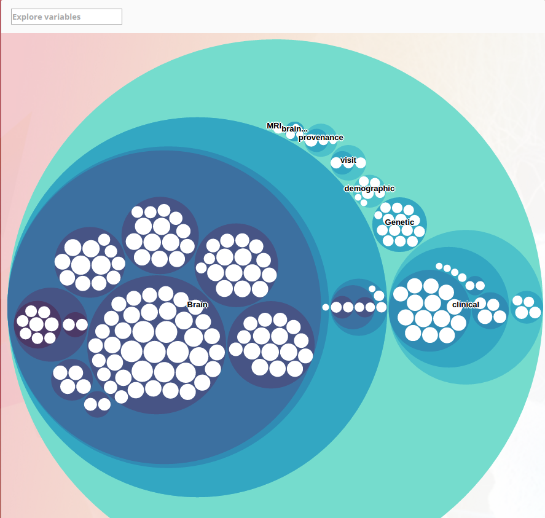
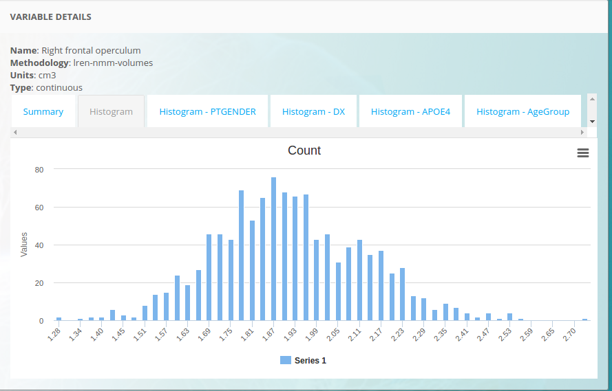
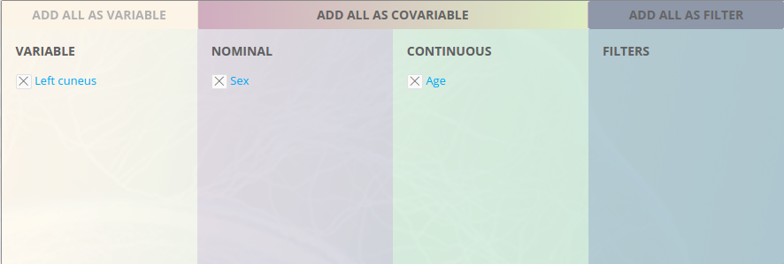
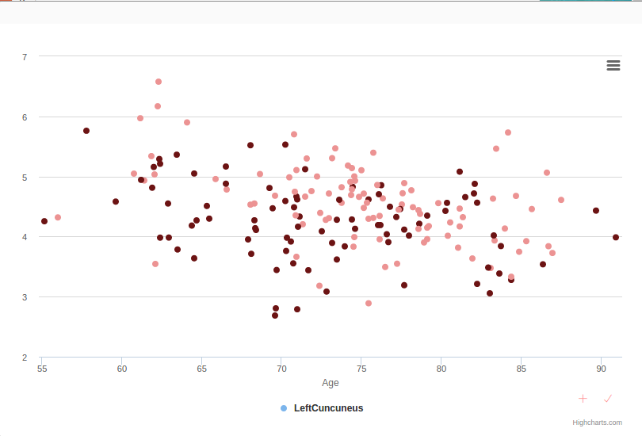
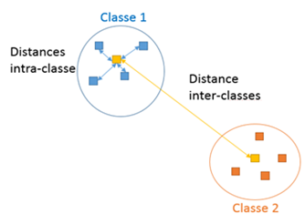

.. AutoML's documentation master file, created by sphinx-quickstart.
   You can adapt this file completely to your liking, but it should at least
   contain the root `toctree` directive.

Welcome to AutoML's documentation!
=============================================

Abstract
============

.. raw:: latex

   \clearpage

.. toctree::
   :numbered:
   :maxdepth: 5

.. raw:: latex

   \clearpage

Introduction
============

Le présent document fait office de rapport de projet.
Il permet de comprendre le contexte de celui-ci, de reconstituer son cheminement du projet,
de comprendre les choix et les déductions effectuées, ainsi que de connaître l'état final
du travail et les perspectives d'amélioration.

Contexte du projet
----------------

Le présent projet s'inscrit dans le cadre du travail de Bachelor en Informatique option "Développement logiciel
et multimédia", réalisé à la HE-ARC de Neuchâtel.

Le projet est effectué pour le CHUV-LREN dans le cadre du projet Human Brain Project.

Human Brain projet
~~~~~~~~~~~~

Ce projet s’inscrit dans le cadre du projet Européen « Human Brain Project ».
Ce chapitre vise à expliquer le contexte de la partie du projet qui nous intéresse.

Présentation de la plateforme MIP
~~~~~~~~~~~~~~

Le but du sous-projet 8 du HBP est de fournir une plateforme pour effectuer des
expériences neuroscientifiques sur des données de patients recueillies à travers les
cliniques et hôpitaux partenaires. Etant donné la nature médicale de ces données,
elles sont bien évidemment anonymisées, et il n’est pas possible de retrouver les
données d’un patient, car les données sont présentées sous la forme d’agrégation
par caractéristique, comme le présente la capture d’écran suivante :

   *Représentation des caractéristiques d'intérêts.*

En selectionnant un des ronds blancs, on accède à la variable en question,
et on peut observer différentes statistiques, comme par exemple des vues sous forme d’histogrammes.

   *Exemple d'histogramme d'une variable.*

Il est ainsi possible d’accéder à toutes les caractéristique médicales et ainsi
de les analyser manuellement. La plateforme permet aussi de formuler des expériences
basées sur les données, afin de proposer un modèle personnalisé qui permet d’essayer
de trouver des liens entre les variables des patients et leur diagnostiques médicaux.
La plateforme permet vise à formuler des expériences liées à Alzheimer,
mais d’autres maladie neurologiques pourraient être visées. A partir d’une caractéristique,
l’utilisateur peut décider de formuler une expérience en choisissant dans laquelle
des catégories suivantes il compte l’impliquer :

* Variable
* Co-variable
* Filtre

Via l’interface suivante :

   *Exemple de formulation d'expérience, étape selection des variables. Cet exemple vise à trouver un lien entre la quantité de matière grise dans le Cuneus en fonction de l'age et du sexe.*

Ce qui nous amène vers la possibilité d’analyser des graphes mêlant les différentes
variables. Il est encore possible de paramétrer la représentation sur l’axe via
une boite à outils, afin de faire ressortir les informations intéressantes.

La partie intéressante dans le cadre de ce projet est la possibilité, à partir des
variables sélectionnées, de lancer une expérience d’apprentissage automatique
(machine learning) afin de trouver le modèle qui permet de représenter au mieux
le lien entre les caractéristiques et le diagnostique.

L’aide pour la configuration de l’expérience est présentée ainsi :

   *Résultat de l'expérience de l'illustration 3.  Représentation de la quantité de matière grise en cm3 en fonction de l'age et du sexe (bordeau = femme, rose = homme).*

Les étapes 1 et 2 sont celles qui nous intéressent :

L’étape 1 correspond à la sélection d’un algorithme de machine learning dans
la liste fournie (catégories : analyse statistique, extraction de caractéristiques
et modèle prédictif). Le modèle choisi influence fortement les résultats de l’expérience.

Lorsque le modèle est sélectionne, il est possible, suivant le modèle, de devoir
renseigner des « **paramètres** » pour celui-ci. Nous appellerons ces paramètres
des « **hyper-paramètres** », afin d’éviter la confusion avec les paramètres
qui sont les coefficients internes qui ont été déterminés après l’entraînement.
Les hyper-paramètres définissent un fonctionnement interne (par exemple, pour le
modèle KNN TODO:Liens vers KNN, l’hyper-paramètre k désigne le nombre des voisins les plus proches
sur lesquels on veut travailler). Le choix de ces hyper-paramètres est donné au
points deux de cette marche à suivre. Pour un même modèle, le choix d’un
hyper-paramètres plutôt qu’un autre change à nouveau drastiquement les résultats.

Il peut définir plusieurs configurations "modèle-paramètres" pour une expérience.
Une expérience ne donne pas instantanément ses résultats. L’utilisateur est notifié
lorsque les résultats sont consultables.

C’est ici que s’inscrit le projet. L’utilisateur, qui est probablement plus un spécialiste
en neuroscience qu’en informatique, se trouve obligé de paramétrer et choisir des données
qui sont liées uniquement à l’informatique.

But du projet
~~~~~~~~~~~~~~

Ce projet a pour but de mettre en place un moyen pour que l’utilisateur n’ait plus
à s’occuper du choix du modèle et du paramétrage pour son expérience, et que la
plateforme s’occupe de trouver automatiquement la meilleure configuration possible.
Dans l’idéal, l’utilisateur n’a qu’un bouton a presser pour cette étape.

Cahier des charges (lien vers les annexes je suppose, en sachant qu'il est expliqué en détail dans le document)
============

Se référer au cahier des charges fourni en annexes.

Etat de l'Art : Passage en revue des différentes technologies, de la plus globale à la plus précise. En vue : Machine learning, Docker, Scala, AKKA, Marathon, even. ZeroMQ + autres technologies qui pourraient surgir.
============

Avant de se lancer dans la partie plus en détail dans la description de la plateforme,
il est intéressant d’effectuer un état de l’art des technologies qui pourraient
nous intéresser. Etant donné que le projet consiste à ajouter des fonctionnalités
à un projet existant, cette section décrira les technologies actuellement existantes,
ainsi que les technologies qui seront probablement utilisées, ou tout du moins
leur champ d’application.

Cette section est rédigée en listant les différentes technologies, de la plus globale
à la plus précise en terme d’utilisation dans le projet.

Théorie *Machine Learning*
------------

Le machine learning (apprentissage automatique en francais), est un champ d’activité
de l’intelligence artificielle qui vise à permettre à une machine d’apprendre par elle-même
plutôt que d’en fixer tous les comportements de manière programmatique.
Elle est particulièrement utilisée dans les problématiques où le nombre de cas
est trop important pour être codés à la mano. Le panel d’utilisation est large,
il peut par exemple concerner :

* L’analyse de graphes ou de données
* La classification d’individus
* La résolution de problèmes de régression
* La reconnaissance d’objets
* L’analyse de documents (notamment pour les moteurs de recherche)
* La reconnaissance de caractères manuscrits
* L’aide au diagnostiques médicaux

Dans notre cas, l’apprentissage automatique est implémenté dans la plateforme via les méthodes suivantes :

* TODO : Remplir via la Query-list

Mais on peut aussi ajouter à la plateforme d’autres méthodes d’apprentissage automatique
via des containers Docker. TODO : Compléter cette fonctionnalité quand on aura plus d’infos.

Apprentissage supervisé
~~~~~~~~~~~~

Dans cette méthodologie, on connait déjà les classes que l’on souhaite pouvoir déterminer
automatiquement via l’algorithme. Ces classes sont tirées des données par un expert.
Dans certains cas, il est aussi possible d’attribuer une probabilité d’appartenance à une classe.
L’apprentissage se déroule généralement en deux phases. La première phase est dite d’entrainement.
Elle consiste à déterminer un modèle qui permet de reproduire pour de nouvelles données la même
classification/régression que celle donnée via les labels. La seconde phase est dite de validation.
Elle consiste à déterminer si le modèle entrainé est pertinent, via des méthodes métriques.
Ces deux phases ne s’effectuent pas sur les mêmes données. La phase d’entrainement nécessite
une quantité d’informations suffisantes afin d’avoir un modèle représentatif.

Apprentissage non supervisé
~~~~~~~~~~~~

Cet apprentissage s’applique à des données qui ne sont pas labellées par des classes.
C’est ici à la machine de déterminer les différentes classes qui représentent le problème.
A partir d’un ensemble de données en entrées, il va chercher à créer des classes représentatives
pour celles-ci, en maximisant la distance inter-classe, et en minimisant la distance des éléments intra-classe.

   *Représentation des distances inter-classe et intra-classe. Illustration issue du site MSDN TODO:LINK*

Cette méthodologie peut aussi permettre d’analyser la relation entre les variables, par
exemple pour réduire la dimension des vecteurs d’entrées.

Apprentissage semi-supervisé
~~~~~~~~~~~~~~~

Etant donné que l’apprentissage supervisé nécessite un labelisation des données par expert,
il devient très coûteux de réaliser ce travail au fur et à mesure que les données augmentent.
L’utilisation de données labellées, liées à des données labellées, peut permettre d’améliorer
la qualité de l’apprentissage. Par exemple, il est ainsi possible d’utiliser un classificateur
crée par l’apprentissage supervisé, et un autre crée par l’apprentissage non-supervisé.

Idéalement, les deux classificateurs ne se basent pas sur les mêmes caractéristiques, ce qui
permet de recouper les deux classificateurs afin d’affiner la classification finale.

Optimisation automatique du pipeline d'apprentissage
---------------

De manière générale, le Machine Learning est décrit comme une suite d'opérations à
effectuer de manière séquentielle pour permettre de résoudre une problématique. On parle dès
lors de pipeline, étant donné que chaque étape est effectuée, à la manière d'un flux
d'opérations, de la première à la dernière.

Ce pipeline est généralement découpé en deux phases distinctes :

* Extraction, normalisation et éventuellement construction des caractéristiques à partir des données brutes.
* Application d'un modèle statistique ou linéaire pour effectuer, selon la problématique, une classification ou une régression.

On peut représenter ce flux via la représentation suivante :

.. figure:: images/ml_pipeline.png
   :width: 500px
   :align: center
   :alt: Exemple d'un pipeline de Machine Learning, tiré de la documentation TPOT :cite:`Olson2016EvoBio` et modifié pour supprimer les parties liées à TPOT.

   *Exemple d'un pipeline de Machine Learning, tiré de la documentation TPOT :cite:`Olson2016EvoBio` et adapté pour supprimer les parties liées à TPOT.*

Dans une approche traditionnelle d'optimisation d'une expérience de Machine Learning,
on essaie de faire varier les hyper-paramètres du modèle (p.e via les grid-search :cite:`@datagridsearchdoc` de Scikit-Learn :cite:`scikit-learn`).

Cette méthode permet d'optimiser les hyperparamètres du modèle, mais celui-ci doit avoir
été selectionné manuellement auparavant. De plus, l'étendue et le pas des hyper-paramètres sont
eux-aussi déterminés manuellement, ce qui réduit le domaine d'exploration.

Une tendance émergente de ces dernières années est d'utiliser des méthodes d'intelligence artificielle pour
explorer l'espace des solutions de manière automatique, et optimisée. Cette exploration est souvent effectuée
via des algorithmes génétiques [TODO:Lien(s) qui explique les principes], car ils
correspondent à la problématique d'exploration d'un espace de solutions de grande dimension,
de manière non dirigée, tout en fournissant un résultat exploitable.

TODO:Vérifier la phrase sur les algos génétiques + reprendre du cours si besoin.

Les réelles avancées dans le domaine sont récentes, les premiers articles concrets datent de
2016, et il est difficile de trouver des exemples dans un domaine concret, prouvant l'efficacité de *l'Automated Machine Learning*.
Les créateurs de bibliothèque TPOT :cite:`Olson2016EvoBio` ont rédigé deux papiers TODO:Références + annexes
d'exemple d'applications dans des cas réels, sur la classification de cas de cancers de la prostate,
de manière conventionnelle, et via l'approche *Automed Machine Learning", et ont pu mettre en avant
une amélioration des résultats.
Google a récemment communiqué son intérêt pour le domaine, en annoncant l'ouverture d'un département
sur la recherche de cette discipline. TODO:Lien vers la conférence Youtube.
Certaines sites spécialisés TODO:Lien vers le site http://www.kdnuggets.com/2017/01/current-state-automated-machine-learning.html
décrivent ce domaine avec intérêt, mais en précisant que les résultats ne sont pas encore
probants, et que, pour le moment, elle n'est pas applicable à toutes les problématiques.

Dans le cadre du projet, étant donné que les utilisateurs ne sont pas experts dans
le domaine du *Machine Learning*, il est que les résultats soient meilleurs que
les configurations des utilisateurs.

Si le travail abouti à une expérience, il est possible que celui-ci soit publié.

Technologies
---------------

Systèmes distribués
~~~~~~~~~~~~~~~

Historiquement, avant que le web ne vienne changer la donne, une application était
localisé sur une machine unique, et son architecture se présentait ainsi :

TODO:Image

Avec l'augmentation de la demande, la première approche pour augmenter la capacité
de réponse a été de parraléliser plusieurs machines sur le réseau, et d'effectuer
un balancage de charge entre les différentes instances, en fonction des moyens.

Les machines sont déployées en cluster (groupes de machines), et le *load-balancer*
s'occupe de répartir les requêtes.

TODO:Image

Avec la venue d'internet, l'utilisation des applications a changée, et elles ont
été amenées à communiquer entre elles, afin de partager des données ou des services.

Dès lors, le découpage des applications s'est effectué par bloc, chaque application
étant indépendante, mais fourni une interface comme point d'entrée pour communiquer,
et s'appuie généralement sur un format d'encodage haut-niveau (XML, JSON, ...)
pour formuler des réponses aux autres applications. On a ainsi un découpage plus fin
des fonctionnalités, mais ce découpage engendre un travail supplémentaire pour le
programmeur.

TODO:image

Etant donné que les machines sont indépendantes, la gestion des ressources s'effectue
pour chacune en local. Dans l'approche d'un système distribué, on cherche à pouvoir
gérer le plus finement les ressources au niveau du cluster, et pas uniquement par
un balanceur de charge.

La mise en place de systèmes d'exploitation distribués tels que *DC/OS* est un système
qui se superpose au système d'exploitation de la machine, et qui fournit une gestion
fine des ressources.

TODO:Image

*DC/OS* est issu de la *Mesosphere*, un ensemble d'outils fournis par Apache qui
répondent spécifiquement aux problématiques du cloud-computing. L'architecture du CHUV
est basée sur les outils de la *Mesossphere*, mais n'utilise pas *DC/OS* au complet.

Les outils utilisés dans le cadre du projet sont décrits dans la suite du document.

Mesos
~~~~~~~~~~~~~~~

Elément central de l'architecture distribuée utilisée au CHUV, *Mesos*

Docker
~~~~~~~~~~~~~~~

Parler de Docker-hub, de la publication d'image, etc.

Chronos
~~~~~~~~~~~~~~~

Marathon
~~~~~~~~~~~~~~~

Scala
~~~~~~~~~~~~~~~

Ce travail est effectué au cœur du projet Woken 1du Human Brain Project. Ce projet
contient le langage de programmation Scala2. Scala a été concu à l’école polytechnique
de Lausanne (EPFL) afin de proposer de lier des paradigmes de programmation différents
et habituellement opposés, tels que la programmation fonctionnelle et la programmation
orientée objet. Scala se base sur la JVM3, ce qui permet de bénéficier de l’abstraction
de celle-ci en termes de plateforme d’exécution, ainsi que pour la gestion de la mémoire,
notamment. Scala coopère ainsi de manière transparente avec Java, ce qui permet d’utiliser
des bibliothèques non codées en Scala.

Cette section ne précise pas la syntaxique du langage, ni son utilisation.

AKKA
~~~~~~~~~~~~~~~
Akka1 est un outil de développement et un environnement d’exécution libre et
open-source qui a pour but de simplifier la mise en place d’applications distribuées
et concurrentes basée sur la JVM. Il gère donc les langages de programmations Java et Scala,
et est développé en Scala. Akka propose une résolution des problèmes de concurrence
via un système d’acteurs.

Chaque acteur propose des fonctionnalités, et peut communiquer avec les autres en
envoyant des messages.  Lorsqu’un acteur reçoit un message, il le traite, effectue des
actions et peut envoyer d’autres messages, instancier d’autres acteurs ou encore se stopper.

Chaque acteur est un client léger, qui possède son état et sa boite aux lettres.
Lorsqu’un acteur plante, il est réinstancié automatiquement, dans le même état
qu’il était avant, et avec sa file de message, ce qui procure une haute disponibilité.
De plus, lorsqu’un acteur enfant plante, le parent est notifié, et il peut dès lors
prendre des mesures. Les messages sont asynchrones,ce qui permet de ne pas avoir
d’état bloquant en cas de latence réseau ou tout autre problème technique.
Akka s’occupe de distribuer les acteurs sur le cluster, ce qui permet d’avoir un
haut niveau d’abstraction pour le programmeur.

Scikit-Learn
~~~~~~~~~~~~~~~

:cite:`scikit-learn`

Captain
~~~~~~~~~~~~~~~

Analyse
================

La place de Woken dans l'architecture globale (succinct, sans parler de toute la plateforme)
------------

Fonctionnement interne de Woken
------------

But
~~~~~~~~~~~~

Entrées et sorties
~~~~~~~~~~~~

Flux de traitement (présentation du diagramme d'acteurs réalisé en début de projet)
~~~~~~~~~~~~

Conception
============

Modification du workflow Woken
------------

Nouveau diagramme d'acteurs imaginé, et comment on coupe le workflow actuel
~~~~~~~~~~~~

La problématique Marathon (intégration encore non définie)
~~~~~~~~~~~~

Implémentation réalisée
============

Création d'un container interactif
------------

Problème initial
~~~~~~~~~~~~

Présentation des solutions au problème
~~~~~~~~~~~~

Choix effectué
~~~~~~~~~~~~

Modification du workflow Woken
------------

Ajout du nouveau container dans la configuration
~~~~~~~~~~~~

Intégration de TPOT
------------

A déterminer, mais je suppose : Les contraintes posées par la bibliothèque, les choix qui ont du être effectués.
~~~~~~~~~~~~

Eventuellement, si plus de travail a été effectué, présentation de celui-ci.
------------

Validation (Expérience)
============

6.1 Présentation de l'expérience
    6.1.1 pourquoi
    6.1.2 comment
    6.1.3 les conditions de tests
6.2 Résultats de l'expérience
6.3 Discussion des résultats

Conclusion
============

Etat des lieux au moment du rendu
------------

- Atteintes des objectifs

  - Le contexte du mandant a-t-il été compris?
  - L'API se superposant à Marathon fonctionne-t-elle?
  - Un format de métadonnées a-t-il été spécifié? Existe-t-il un moyen
    de vérifier que telle ou telle image Docker respecte ce format?
  - Un démonstrateur a-t-il été développé?

- Améliorations possibles

.. Le développeur a pris un risque en prenant en tester des technologies
.. qu'il n'utiliserait peut-être même pas mais cela lui a permis de mieux saisir
.. la problématique.

Perspectives et améliorations
------------

Bilan personnel (Présenter ce qui apporte quelque chose)
------------

Remerciements
=============

Annexes, références et Table des illustrations.
============

TODO:Annexes :
- CdC
- Journal de travail
- TPOT papers
-

.. .. raw:: latex

..  \bibliographystyle{plain}
..  \bibliography{references.bib}

.. bibliography:: references.bib
   :all:
   :style: unsrt

.. Indices and tables
.. ==================

.. * :ref:`genindex`
.. * :ref:`modindex`
.. * :ref:`search`
