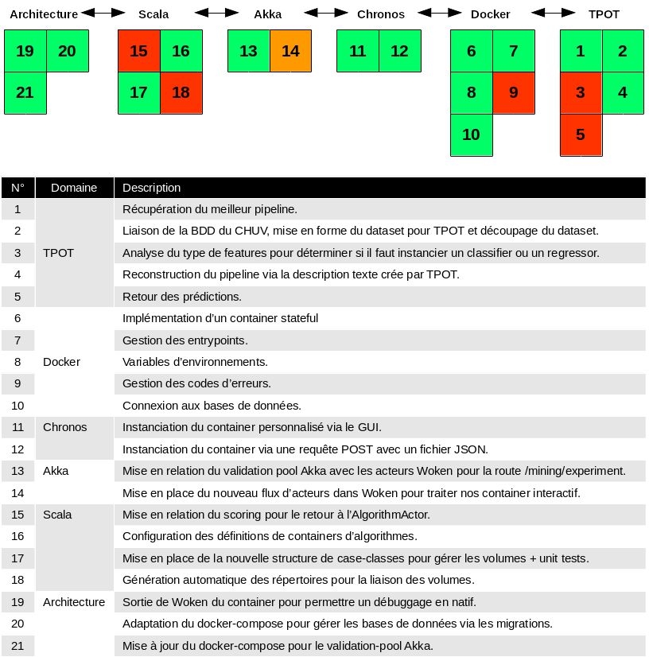

.. AutoML's documentation master file, created by sphinx-quickstart.
   You can adapt this file completely to your liking, but it should at least
   contain the root `toctree` directive.

Bienvenue sur la documentation du travail de Bachelor Auto ML
=============================================================

.. raw:: latex

   \clearpage

.. toctree::
   :numbered:
   :maxdepth: 4  

.. raw:: latex

   \clearpage

Introduction
============

Le présent document fait office de rapport de projet.
Il permet de comprendre le contexte de celui-ci, de décrire les éléments qui le compose,
fait une analyse de la problématique, la conception en vue de la résolution et
présente l'implémentation effectuée. Ce document ne présente pas tout le cheminement,
mais uniquement l'état final

Contexte du projet
----------------

Le présent projet s'inscrit dans le cadre du travail de Bachelor en Informatique option "Développement logiciel
et multimédia", réalisé à la HE-ARC de Neuchâtel.

Le projet est effectué pour le CHUV-LREN dans le cadre du "Human Brain Project".

Human Brain projet
~~~~~~~~~~~~

Ce projet s’inscrit dans le cadre du projet Européen « Human Brain Project ».
Ce chapitre vise à expliquer le contexte du sous-projet 8, et ce qui nous intéresse.

Présentation de la plateforme MIP
~~~~~~~~~~~~~~

Le but du sous-projet 8 du HBP est de fournir une plateforme pour effectuer des
expériences neuroscientifiques sur des données de patients recueillies à travers les
cliniques et hôpitaux partenaires. Etant donné la nature médicale de ces données,
elles sont bien évidemment anonymisées, et il n’est pas possible de retrouver les
données d’un patient, car les données sont présentées sous la forme d’agrégation
par caractéristique, comme le présente la :num:`figure #features`

.. raw:: latex

   \clearpage

.. _features:
.. figure:: images/Agregation_features_MIP.png
   :width: 500px
   :align: center
   :alt: Représentation des caractéristiques d'intérêts

   *Représentation des caractéristiques d'intérêts.*

En sélectionnant un des ronds blancs, on accède à la variable en question,
et on peut observer différentes statistiques, comme par exemple des vues sous forme d’histogrammes [cf :num:`figure #histogram`]

.. raw:: latex

   \clearpage

.. _histogram:
.. figure:: images/Histogram_features_MIP.png
   :width: 450px
   :align: center
   :alt: Exemple d'histogramme d'une variable.

   *Exemple d'histogramme d'une variable.*

Il est ainsi possible d’accéder à toutes les caractéristiques médicales et ainsi
de les analyser manuellement. La plateforme permet aussi de formuler des expériences
basées sur les données, afin de proposer un modèle permettant d’essayer
de trouver des liens entre les variables des patients et leur diagnostiques médicaux.
La plateforme vise à formuler des expériences liées à Alzheimer,
mais d’autres maladie neurologiques pourraient être visées. A partir d’une caractéristique,
l’utilisateur peut décider de formuler une expérience en choisissant dans laquelle
des catégories suivantes il compte l’impliquer :

* Variable, qui correspondent à la cible de l'expérience;
* Co-variable, qui correspondent aux variables de l'expériences.
* Filtre

Via l’interface suivante présentée en :num:`figure #variables`.

.. _variables:
.. figure:: images/Variables_experiences.png
   :width: 450px
   :align: center
   :alt: Exemple de formulation d'expérience, étape selection des variables. Cet exemple vise à trouver un lien entre la quantité de matière grise dans le Cuneus en fonction de l'age et du sexe.

   *Exemple de formulation d'expérience, étape selection des variables. Cet exemple vise à trouver un lien entre la quantité de matière grise dans le Cuneus gauche en fonction de l'age et du sexe.*

Ce qui permet d’analyser des graphes mêlant les différentes
variables. Il est encore possible de paramétrer la représentation sur l’axe via
une boite à outils, afin de faire ressortir les informations intéressantes, comme le montre la :num:`figure #resultnoml`

.. _resultnoml:

   *Résultat de l'expérience formulée Représentation de la quantité de matière grise en cm3 en fonction de l'age et du sexe (bordeau = femme, rose = homme).*

La partie intéressante dans le cadre de ce projet est la possibilité, à partir des
variables sélectionnées, de lancer une expérience d’apprentissage automatique
(*Machine Learning*) afin de trouver le modèle qui permet de représenter au mieux
le lien entre les caractéristiques et le diagnostique.

L’aide pour la configuration de l’expérience est présentée comme en :num:`figure #helpconfig`

.. _helpconfig:
.. figure:: images/description_experience.png
   :width: 600px
   :align: center
   :alt: Aide pour la formulation d'une expérience de Machine Learning.

   *Aide pour la formulation d'une expérience de Machine Learning.*

Les étapes 1 et 2 sont celles qui nous intéressent :

L’étape 1 correspond à la sélection d’un algorithme de *Machine Learning* dans
la liste fournie (catégories : analyse statistique, extraction de caractéristiques
et modèle prédictif). Le modèle choisi influence fortement les résultats de l’expérience.

Lorsque le modèle est sélectionné, il est nécessaire, suivant le modèle, de devoir
renseigner des « **paramètres** » pour celui-ci. Nous appellerons ces paramètres
des « **hyper-paramètres** », afin d’éviter la confusion avec les paramètres
qui sont les coefficients internes qui ont été déterminés après l’entraînement.
Les hyper-paramètres définissent l'architecture ou le fonctionnement de l'algorithme (par exemple, pour le
modèle KNN, l’hyper-paramètre k désigne le nombre des voisins les plus proches
sur lesquels on veut travailler). Le choix de ces hyper-paramètres est donné au
points 2 de cette marche à suivre. Pour un même modèle, le choix d’un
hyper-paramètres plutôt qu’un autre change à nouveau drastiquement les résultats.

L'utilisateur peut définir plusieurs configurations "modèle-paramètres" pour une expérience.
Une expérience ne donne pas instantanément ses résultats. L’utilisateur est notifié
lorsque les résultats sont consultables.

C’est ici que s’inscrit le projet. L’utilisateur, qui est probablement plus un spécialiste
en neuroscience qu’en informatique, se trouve obligé de paramétrer et choisir des données
qui sont liées uniquement à l’informatique.

But du projet
~~~~~~~~~~~~~~

Ce projet a pour but de mettre en place un moyen pour que l’utilisateur n’ait plus
à s’occuper du choix du modèle et du paramétrage pour son expérience, et que la
plateforme s’occupe de trouver automatiquement la meilleure configuration possible.
Dans l’idéal, l’utilisateur n’a qu’un bouton à presser pour cette étape.

Cahier des charges (lien vers les annexes je suppose, en sachant qu'il est expliqué en détail dans le document)
============

Se référer au cahier des charges fourni en annexes.

Etat de l'Art
============

Avant de se lancerdans la description du travail,
il est intéressant d’effectuer un état de l’art des technologies qui pourraient
nous intéresser. Etant donné que le projet consiste à ajouter des fonctionnalités
à un projet existant, cette section décrira les technologies actuellement existantes,
ainsi que les technologies ajoutées, ou tout du moins leur champ d’application.

Cette section est rédigée en listant les différentes technologies, de la plus globale
à la plus précise en terme d’utilisation dans le projet.

Théorie Machine Learning
------------

Le *Machine Learning* (apprentissage automatique en francais), est un champ d’activité
de l’intelligence artificielle qui vise à permettre à une machine d’apprendre par elle-même
plutôt que d’en fixer tous les comportements de manière programmatique.
Elle est particulièrement utilisée dans les problématiques où le nombre de cas
est trop important pour être codés à la mano. Le panel d’utilisation est large,
il peut par exemple concerner :

* L’analyse de graphes ou de données
* La classification d’individus
* La résolution de problèmes de régression
* La reconnaissance d’objets
* L’analyse de documents (notamment pour les moteurs de recherche)
* La reconnaissance de caractères manuscrits
* L’aide au diagnostiques médicaux

Dans notre cas, l’apprentissage automatique est implémenté dans la plateforme via les méthodes suivantes :

* Résumé statistique ;
* Analyse de la variance (anova) ;
* Régression linéaire ;
* KNN
* Classification naïve bayésienne

Mais on peut aussi ajouter à la plateforme d’autres méthodes d’apprentissage automatique
via des containers *Docker* préconfigurés qui sont fournis par le projet.

Apprentissage supervisé
~~~~~~~~~~~~

Dans cette méthodologie, on connait déjà les classes que l’on souhaite pouvoir déterminer
automatiquement via l’algorithme. Ces classes sont tirées des données par un expert.
Dans certains cas, il est aussi possible d’attribuer une probabilité d’appartenance à une classe.
L’apprentissage se déroule généralement en deux phases. La première phase est dite d’entrainement.
Elle consiste à déterminer un modèle qui permet de reproduire pour de nouvelles données la même
classification/régression que celle donnée via les labels. La seconde phase est dite de validation.
Elle consiste à déterminer si le modèle entrainé est pertinent, via des méthodes métriques.
Ces deux phases ne s’effectuent pas sur les mêmes données. La phase d’entrainement nécessite
une quantité d’informations suffisantes afin d’avoir un modèle représentatif.

Apprentissage non supervisé
~~~~~~~~~~~~

Cet apprentissage s’applique à des données qui ne sont pas labellées par des classes.
C’est ici à la machine de déterminer les différentes classes qui représentent le problème.
A partir d’un ensemble de données en entrées, il va chercher à créer des classes représentatives
pour celles-ci, en maximisant la distance inter-classe, et en minimisant la distance des éléments intra-classe
comme représenté sur la :num:`figure #distanceml`.

.. _distanceml:
.. figure:: images/distance_illustration.png
   :width: 300px
   :align: center
   :alt: Représentation des distances inter-classe et intra-classe. Illustration issue du site Microsoft :cite:`@theoryMLMS`

   Représentation des distances inter-classe et intra-classe. Illustration issue du site MSDN :cite:`@theoryMLMS`

Cette méthodologie peut aussi permettre d’analyser la relation entre les variables, par
exemple pour réduire la dimension des vecteurs d’entrées.

Apprentissage semi-supervisé
~~~~~~~~~~~~~~~

Etant donné que l’apprentissage supervisé nécessite un labelisation des données par expert,
il devient très coûteux de réaliser ce travail au fur et à mesure que les données augmentent.
L’utilisation de données labellées, liées à des données labellées, peut permettre d’améliorer
la qualité de l’apprentissage. Par exemple, il est ainsi possible d’utiliser un classificateur
crée par l’apprentissage supervisé, et un autre crée par l’apprentissage non-supervisé.

Idéalement, les deux classificateurs ne se basent pas sur les mêmes caractéristiques, ce qui
permet de recouper les deux classificateurs afin d’affiner la classification finale.

Optimisation automatique du pipeline d'apprentissage
---------------

De manière générale, le *Machine Learning* est décrit comme une suite d'opérations à
effectuer de manière séquentielle pour permettre de résoudre une problématique. On parle dès
lors de pipeline, étant donné que chaque étape est effectuée, à la manière d'un flux
d'opérations, de la première à la dernière.

Ce pipeline est généralement découpé en deux phases distinctes :

* Extraction, normalisation et éventuellement construction des caractéristiques à partir des données brutes.
* Application d'un modèle statistique ou linéaire pour effectuer, selon la problématique, une classification ou une régression.

On peut représenter ce flux via la :num:`figure #mlpipeline`:

.. _mlpipeline:
.. figure:: images/ml_pipeline.png
   :width: 650px
   :align: center
   :alt: Exemple d'un pipeline de *Machine Learning*, tiré de la documentation TPOT :cite:`Olson2016EvoBio` et modifié pour supprimer les parties liées à TPOT.

   Exemple d'un pipeline de Machine Learning, tiré de la documentation TPOT :cite:`Olson2016EvoBio` et adapté pour supprimer les parties liées à TPOT.

.. raw:: latex

   \clearpage

.. _mlphases:
On peut en décrire les phases ainsi :

* **Data Cleaning** : Mise en forme des données et nettoyage. Ceci peut consister à renseigner les données manquantes.
* **Features Preprocessing** : Transformation des caractéristiques pour les rendre plus utilisables dans le contexte, par exemple en les normalisant.
* **Features Selection** : Sélection des caractéristiques les plus pertinentes pour le modèle.
* **Feature Construction** : Création de nouvelles caractéristiques à partir des données.
* **Model Selection** : Sélection du type de modèle ainsi que les hyper-paramètres liés à celui-ci (p.e. pour un réseau de neurones, le nombre de couches de neurones). Actuellement, l’utilisateur doit les configurer lui-même, et même un utilisateur expert ne peut pas garantir que ce sont les meilleurs hyper-paramètres possibles.
* **Parameter Optimization** : le choix d’un modèle détermine les paramètres qui lui sont liés (p.e. pour un réseau de neurones, le poids de chaque neurone). Ces paramètres  influencent énormément la performance du modèle. Ils sont définis lors de cette phase.
* **Model Validation** : En sortie, nous avons, pour un ensemble de caractéristiques donnée, un modèle et le hyper-paramètres de ce modèle. Il faut ensuite valider ce modèle sur un ensemble de sujets différents afin de déterminer sa pertinence.

Dans une approche traditionnelle d'optimisation d'une expérience de *Machine Learning*,
on essaie de faire varier les hyper-paramètres du modèle (p.e via les grid-search :cite:`@datagridsearchdoc` de Scikit-Learn :cite:`scikit-learn`).

Cette méthode permet d'optimiser les hyper-paramètres du modèle. Ce dernier doit avoir
été sélectionné manuellement auparavant par l'utilisateur. De plus, l'étendue et le pas des hyper-paramètres sont
eux-aussi déterminés manuellement, ce qui réduit le domaine d'exploration.

Une tendance émergente de ces dernières années est d'utiliser des méthodes d'intelligence artificielle pour
explorer l'espace des solutions de manière automatique et optimisée. Cette exploration est souvent effectuée
via des algorithmes génétiques car ils
correspondent à la problématique d'exploration d'un espace de solutions de grande dimension.
Cette exploration est effectuée de manière non dirigée tout en fournissant un résultat exploitable.

Les réelles avancées dans le domaine sont récentes, les premiers articles concrets datent de
2016, et il est difficile de trouver des exemples dans un domaine concret, prouvant l'efficacité de *l'Automated Machine Learning* .
Les créateurs de bibliothèque TPOT :cite:`Olson2016EvoBio` ont rédigé deux papiers :cite:`olson2016evaluation` :cite:`olson2016tpot`
d'exemple d'applications dans des cas réels, sur la classification de cas de cancers de la prostate, en comprarant
l'approche conventionnelle et  l'approche *Automed Machine Learning*, et ont pu mettre en avant
une amélioration des résultats.
Google a récemment communiqué son intérêt pour le domaine, en annoncant l'ouverture d'un département
sur la recherche de cette discipline :cite:`@googleautoml`. Certains sites spécialisés :cite:`@stateautoml` :cite:`@hhusain`
décrivent ce domaine avec intérêt, mais en précisant que les résultats ne sont pas encore
probants, et que, pour le moment, elle n'est pas applicable à toutes les problématiques.

Dans le cadre du projet, étant donné que les utilisateurs ne sont pas experts dans
le domaine du *Machine Learning*, il est probable que les résultats soient meilleurs que
les configurations des utilisateurs.

Si le travail abouti à une expérience, il est possible que celui-ci soit publié.

Technologies
---------------

TPOT
~~~~~~~~~~~~~~~

*TPOT* :cite:`Olson2016EvoBio` est une bibliothèque *open-source* permettant l'optimisation
de pipeline automatisée, alias *automated Machine Learning*. Elle se distingue des autres
bibliothèques telles que Auto-WEKA :cite:`@autoweka` et Hyperopt :cite:`@hyperopt` par le fait
qu'il est capable non seulement de faire varier les modèles et le hyper-paramètres,
mais qu'elle est aussi capable de sélectionner, construire ou d'effectuer du préprocessing
sur les caractéristiques. *TPOT* dispose d'une communauté active, et le créateur,*Randy Olson*,
répond très rapidement aux *issues* postées sur le *Github* de *TPOT*.

La :num:`figure #mlpipelinetpot` présente un flux de *Machine Learning*.

.. _mlpipelinetpot:
.. figure:: images/tpot-ml-pipeline.png
   :width: 650px
   :align: center
   :alt: Exemple d'un pipeline de Machine Learning, avec les parties gérées automatiquement par TPOT. Illustration tirée de la documentation TPOT :cite:`Olson2016EvoBio`

   Exemple d'un pipeline de Machine Learning, avec les parties gérées automatiquement par TPOT. Illustration tirée de la documentation TPOT :cite:`Olson2016EvoBio`

Les différentes étapes ont la même signification que présenté au point de :ref:`présentation des phases typiques de machine learning <mlphases>`,
au dessous de la :num:`figure #mlpipeline`.

Cette bibliothèque est codée en Python, et se base sur les modèles de Scikit-learn :cite:`scikit-learn`, ce qui
permet d'avoir une compatibilité avec cette bibliothèque *Python*.

Systèmes distribués
~~~~~~~~~~~~~~~

Historiquement, avant que le web ne vienne changer la donne, une application était
localisé sur une machine unique, et son architecture se présentait comme sur la :num:`figure #computerarchi`

.. raw:: latex

   \clearpage

.. _computerarchi:
.. figure:: images/computer_architecture.png
   :width: 200px
   :align: center
   :alt: Architecture simple basée sur une machine unique

   Architecture simple basée sur une application unique : crédits @ Groovytron :cite:`@groovytron`

Avec l'augmentation de la demande, la première approche pour augmenter la capacité
de réponse a été de parraléliser plusieurs machines sur le réseau, et d'effectuer
un balancage de charge entre les différentes instances, en fonction des moyens.

Les machines sont déployées en cluster (groupes de machines), et le *load-balancer*
s'occupe de répartir les requêtes, comme présenté à la :num:`figure #highavailability`.

.. _highavailability:
.. figure:: images/high_availability_architecture.png
   :width: 500px
   :align: center
   :alt: Architecture orientée haute disponibilité et «scalabilité»

   *Architecture orientée haute disponibilité et «scalabilité» : crédits @ Groovytron*

Avec la venue d'internet, l'utilisation des applications a changée, et elles ont
été amenées à communiquer entre elles, afin de partager des données ou des services.

Dès lors, le découpage des applications s'est effectué par bloc, chaque application
étant indépendante, mais fourni une interface comme point d'entrée pour communiquer,
et s'appuie généralement sur un format d'encodage haut-niveau (XML, JSON, ...).
pour formuler des réponses aux autres applications. On a ainsi un découpage plus fin
des fonctionnalités, mais ce découpage engendre un travail supplémentaire pour le
programmeur.

Etant donné que les machines sont indépendantes, la gestion des ressources s'effectue
pour chacune en local. Dans l'approche d'un système distribué, on cherche à pouvoir
gérer le plus finement les ressources au niveau du cluster, et pas uniquement par
un balanceur de charge.

Un système d'exploitation distribué tel que *DC/OS* est un système
qui se superpose au système d'exploitation de la machine, et qui fournit une gestion
fine des ressources. La :num:`figure #distributedos` permet d'illustrer cette architecture.

.. _distributedos:
.. figure:: images/container_orchestration_revised.png
   :width: 550px
   :align: center
   :alt: Architecture utilisant un outils d'orchestration de containers

   *Architecture superposant un système d'exploitation distribué au système d'exploitation natif de la machine.: crédits @ Groovytron*

*DC/OS* est issu de la *Mesosphere*, un ensemble d'outils fournis par Apache qui
répondent spécifiquement aux problématiques du cloud-computing. L'architecture du CHUV
est basée sur les outils de la *Mesosphere*, mais n'utilise pas *DC/OS* au complet.

Ces outils utilisés dans le cadre du projet sont décrits dans la suite du document.

Mesos
~~~~~~~~~~~~~~~

Elément central de l'architecture distribuée utilisée au CHUV, *Mesos* :cite:`@mesosdoc` est un noyau
exécuté sur chaque machine du cluster, qui fournit une abstraction des ressources
des machines du cluster. Il est ainsi possible de lancer une application en définissant
la quantité de mémoire vive, le nombre de processeurs, et l'espace disque à disposition,
et Mesos s'occupe de gérer les ressources et la localisation de celles-ci, mais aussi
de gérer le redémarrage de services en cas de pannes, et la mise à l'échelle d'un
service.

Il permet de lancer des applications natives, mais aussi des containers *Docker*,
comme c'est le cas dans ce projet.

Le cluster est organisé sous la forme d'un noeud *Master*, et de noeuds *Slaves*.
Le noeud *Master* est responsable de recevoir les demandes d'instanciations de services,
et il envoie les ordres au noeud *Slave* approprié, selon les ressources disponibles.
La communication entre le *Master* et les *Slaves* est effectué via *ZooKeeper*, qui
est un système de stockage clé-valeurs dans un système de fichiers, ce qui permet
de partager les configurations des différents acteurs de l'architecture.

Mesos sert de support pour l'instanciation de services sur notre architecture distribuée.

Marathon
~~~~~~~~~~~~~~~

*Marathon* est un logiciel développé par *Apache* dans le cadre de la *Mesosphere*.
La Mesosphère est l'ensemble des outils qui sont utilisés dans le cadre de *DC/OS*, et qui
sont officiellement soutenus par la fondation *Apache*. *Marathon* joue le rôle de surcouche
à Mesos afin de simplifier le déploiement de **services longues durées**, c'est à
dire qu'une définition de tâche adressée à *Marathon* concerne un certain nombre
d'instances de ce service, et que si une instance vient à se stopper,
*Marathon* va automatiquement relancer une instance de ce service.

Le logiciel fournit une *API REST* :cite:`@marathonapidoc` pour instancier des services
via d'autres applications.

Chronos
~~~~~~~~~~~~~~~

*Chronos* est un logiciel développé par la *communauté* Mesos. Cette communauté,
contrairement à la *Mesosphere*, n'est pas officiellement soutenue par *Apache*,
mais est constituée de gens ayant des interêts à développer des outils liés à la Mesosphère,
et qui collaborent en suivant le développement des outils de la *Mesosphère*.
La pérénité de ces outils ne sont donc pas garantis.

*Chronos* fait office de remplacement à *cron* de *Linux*, qui est un service permettant
de planifier des commandes à effectuer à intervalles réguliers. Chronos permet d'effectuer
le même travail sur un système distribué via *Mesos*.

Il s'oppose à *Marathon* dans son utilisation, car il permet de lancer une commande
ou un container de manière spontanée, ou programmée, mais qu'il ne cherchera pas à
garder en tout temps un certain nombre d'instances en cours d'exécution.

Il fournit une interface graphique [cf :num:`figure #chronosgui`] permettant de programmer une nouvelle tâche planifiée,
mais aussi une *API REST* permettant l'automatisation programmatique de création de tâches.

.. _chronosgui:
.. figure:: images/chronos_gui.png
   :width: 650px
   :align: center
   :alt: Capture d'écran de l'interface graphique de Chronos

   *Capture d'écran de l'interface graphique de Chronos*

Docker
~~~~~~~~~~~~~~~

*Docker* est une solution *open-source* qui permet d'embarquer une application
dans un container *Linux* qui peut être executé sur n'importe quelle machine supportant
le moteur *Docker*.

Dans une deuxième mesure, il fournit des mécanismes pour rendre un container proche
de la virtualisation, en permettant d'isoler les containers entre eux, mais tout en
fonctionnant sur le même système hôte. Ceci a l'avantage par rapport à la virtualisation
de ne pas embarquer le système d'exploitation pour chaque container virtuel, ce qui
réduit la taille des images. En revanche, étant donné que le système d'exploitation
est partagé, et malgré les mécanismes d'isolation entre container et hôte, il est très
difficile d'arriver à un niveau de sécurité identique à celui des machines virtuelles,
qui elles peuvent être sécurisées jusqu'aux niveau des instructions micro-processeurs.

Docker s'utilise généralement pour uniformiser les conditions de développement, car on
peut dire qu'une image fonctionnant en *stand-alone* (c'est à dire sans interactions
avec le système hôte, comme par exemple un montage de volume) doit fonctionner sur une autre machine
supportant le moteur *Docker*.

D'un point de vue haut niveau, un container est par défaut isolé de l'hôte au niveau :

* du réseau ;
* du système de fichier ;
* des paquets installés ;
* des services ;
* des utilisateurs.
* des processus (en partie);

Ce qui n'implique pas qu'il est impossible d'accéder à ces différentes instances
de l'hôte, plus ou moins sciemment.

Docker se base sur un système d'image et d'héritage. Il est possible de créer son image
personnalisée à partir d'une image minimale fournie par la communauté comme :

* BusyBox;
* CentOS / Scientific Linux CERN (SLC) on Debian/Ubuntu or on CentOS/RHEL/SLC/etc;
* Debian / Ubuntu;

Mais aussi from :code:`scratch`, ou via une archive :cite:`@createbaseimagedocker`.

De plus, on peut hériter de n'importe quelle image et la redéfinir via sa propre surcouche.
Les images dont on hérite ne sont pas modifiables. L'héritage est possible pour toute image
publiée sur un dépot d'image Docker (généralement Docker Hub, mais on peut en utiliser d'autres).

La spécialisation du comportement d'un container Docker s'effectue via un fichier de
définition, le `Dockerfile`. Ce fichier est constitué de commandes :cite:`@dockerfilereference`
qui peuvent effectuer des actions pour construire l'image, dont les principales sont :

* Définir de quelle image on hérite;
* Copier un fichier de l'hôte à l'intérieur du système de fichier interne;
* Exécuter une commande bash;
* Définir des variables d'environnements;
* Définir quels ports on veut exposer à l'hôte.

Si on souhaite pouvoir choisir entre plusieurs commandes, on peut définir des :code:`entrypoints`,
qui définissent un script que l'on peut exécuter suivant les paramètres d'appels
du container.

Il y a deux méthodes d'intéraction avec un container :

* :code:`docker run`
* :code:`docker exec`

La méthode `run` instancie le container. Il permet de définir des paramètres qui définiront
des caractéristiques internes ou externes du container. Il est par exemple possible de
définir le nom du container, un argument d'entrée (utilisable par l'entrypoint) ou
des variables d'environnement. Suivant l'implémentation du container, il est possible
que celui-ci agisse comme un service, et se maintienne en vie, en attente de nouveaux
événements, ou qu'il se termine dès que le travail interne soit terminé. Dans les deux cas,
il se contente d'attendre que le travail interne(souvent implémenté par un script) renvoie
un code d'exécution. :cite:`@codeerrorissue`

La méthode exec ne peut s'appeler que sur un container qui a déjà été instancié.
Si le container est en cours d'exécution, il est possible d'envoyer une nouvelle commande
au container. La plus classique est l'exécution d'un bash en mode interactif, via la commande
code:`docker exec -it containername bash` qui permet d'exécuter une ligne de commande bash.
Le paramètre `-it` permet justement de laisser la commande en mode intéractif, ce qui
permet de ne pas fermer l'exécution de la commande dès que celle-ci renvoie un code `0`.

Il est possible de formuler une description d'architecture composée de containers
*Docker* sous la forme d'un fichier `docker-compose.yml`, qui peut se présenter ainsi :

.. literalinclude:: examples/docker-compose.yml
   :language: yaml

On peut ici voir les configurations de variables d'environnement, de volumes, d'exposition
de ports du container à l'hôte, les versions d'images ainsi que les commandes à
exécuter lorsque le container est prêt.

L'infrastructure peut être lancée via la commande :code:`docker-compose up`. Le fichier
présenté ici ne propose pas de dépendances pour le lancement, ce qui implique que tous
les containers vont tenter de se monter en même temps. Bien qu'une directive :code:`depends-on`
existe pour *docker-compose*, cette option est récente, et ne fonctionne pas à tous les coups.
On préférera utiliser un script *bash* qui s'occupe de démarrer les composants prioritaires
un à un via la commande :code:`docker-compose up nomducomposant`.

Il est intéressant de soulever que *docker-compose* s'occupe seul d'éviter les conflits
de noms de container, contrairement à un démarrage via :code:`docker run`.

Scala
~~~~~~~~~~~~~~~

Ce travail est effectué au cœur du projet Woken du Human Brain Project. Ce projet
contient le langage de programmation Scala :cite:`@scala`. Scala a été concu à l’école polytechnique
de Lausanne (EPFL) afin de proposer de lier des paradigmes de programmation différents
et habituellement opposés, tels que la programmation fonctionnelle et la programmation
orientée objet. Scala se base sur la *JVM*, ce qui permet de bénéficier de l’abstraction
de celle-ci en termes de plateforme d’exécution, ainsi que pour la gestion de la mémoire.
Scala coopère ainsi de manière transparente avec Java, ce qui permet d’utiliser
des bibliothèques non codées en Scala.

AKKA
~~~~~~~~~~~~~~~
Akka :cite:`@akka` est un outil de développement et un environnement d’exécution libre et
open-source qui a pour but de simplifier la mise en place d’applications distribuées
et concurrentes basée sur la JVM. Il gère donc les langages de programmations *Java* et *Scala*,
et est développé en Scala. Akka propose une résolution des problèmes de concurrence
via un système d’acteurs.

Chaque acteur propose des fonctionnalités, et peut communiquer avec les autres en
envoyant des messages.  Lorsqu’un acteur reçoit un message, il le traite, effectue des
actions et peut envoyer d’autres messages, instancier d’autres acteurs ou encore se stopper.

Chaque acteur est un client léger, qui possède son état et sa boîte aux lettres.
Lorsqu’un acteur plante, il est réinstancié automatiquement, dans le même état
qu’il était avant, et avec sa file de message, ce qui procure une haute disponibilité.
De plus, lorsqu’un acteur enfant plante, le parent est notifié, et il peut dès lors
prendre des mesures. Les messages sont asynchrones,ce qui permet de ne pas avoir
d’état bloquant en cas de latence réseau ou tout autre problème technique.
Akka s’occupe de distribuer les acteurs sur le cluster, ce qui permet d’avoir un
haut niveau d’abstraction pour le programmeur.

.. Captain
.. ~~~~~~~~~~~~~~~

.. Captain :cite:`@captain` est un outil qui permet de créer un point

.. _analyse:
Analyse
================

Cette section vise à décrire le cadre logiciel dans lequel le travail sera effectué,
et à préciser les acteurs ainsi que leurs fonctions.

Woken
------------

Woken :cite:`@wokenaxel` est un service, utilisable via une *API REST*, qui fournit la possibilité
d'explorer les données (*data mining* en anglais) de la plateforme. Cette exploration
de données peut être de différentes natures, comme ériger un graphe qui permet
à l'utilisateur de visualiser les données, de demander une analyse statistique,
d'effectuer une expérience de classification via un des algorithmes de classification
fourni, ou encore une expérience de régression.

Chacune de ces explorations de données est effectuée sur un ensemble de données,
qui est qualifié par les champs configurés dans la :num:`Fig. #variables` par l'utilisateur
de la plateforme.

Une expérience fournit des résultats au service demandeur, sous format PFA :cite:`@pfa`,
qui est un format dont la synthaxe est basée sur *yaml*, mais dont la structure est
destinée à décrire des pipeline pour le data-mining.

Des requêtes HTTP sont mises à disposition dans le répertoire :code:`dev-debug/http`
ou :code:`dev-test/http` afin de permettre de se passer de l'interface graphique,
et de simplifier le développement.

Place de Woken dans l'architecture
~~~~~~~~~~~~~~~

Woken étant un service, il est concu pour être utiliser par d'autres services.
La :num:`figure #wokenarchiglobal` présente une version simplifiée de l'architecture
de la plateforme MIP.

.. _wokenarchiglobal:
.. figure:: images/woken_archi_global.png
   :width: 350px
   :align: center
   :alt: Architecture globale simplifiée de la plateforme MIP.

   Architecture globale simplifiée de la plateforme MIP. Le **Portal Frontend** est le point d'accès
   pour l'utilisateur. Il peut consulter les données et effectuer des expériences depuis celle-ci.
   Le **Portal Backend** fournit les mécanismes de sécurité et d'accès aux bases de données, ainsi
   que le passage des demandes à **Woken** si nécessaire. La base de données **Science-db** contient
   les données des patients, tandis que la base de données **Meta-db** contient les descriptions
   de chaque *feature* disponible dans la plateforme. Cette description permet de déterminer différentes
   informations pour la plateforme telles que le type de données (nominale ou continue) ou l'unité de mesure.
   Si il s'agit d'une demande nécessitant un algorithme, c'est **Woken**, l'*algorithm factory*,
   qui va s'occuper de traiter les demandes. **Woken** peut lui-aussi accéder aux bases de données afin
   d'appliquer ses algorithmes. Cette figure est une représentation simplifiée de
   l'architecture, qui ne contient pas tous les intervenants de la plateforme, mais
   uniquement ceux utilisés à cette échelle, dans le projet.

.. raw:: latex

   \clearpage

Lorsque l'utilisateur adresse une requête HTTP contenant une demande d'expérimentation,
le backend envoie une demande de `mining` à woken via une requête POST de la forme :

.. literalinclude:: examples/query-knn.bash
   :language: bash

Ce qui correspond aux paramétrage de l'expérience de l'utilisateur, comme présenté en
:num:`figure #variables`.Woken traite la requête, effectue l'algorithme et retourne une réponse sous
format *PFA*. Le format de réponse n'est pas important dans le cadre de ce projet.

.. _routesrest:
Il existe deux routes REST pour demander à Woken d'effectuer un travail :

* :code:`/mining/job`
* :code:`/mining/experiment`

Le :code:`/mining/job` permet de lancer un seul algorithme à la fois, et permet pas
de lancer des expériences utilisant la *cross-validation*, tandis que la route :code:`/mining/experiment`
permet la *cross-validation* et de lancer plusieurs algorithmes.

La requête pour une expérience via la route :code:`/mining/experiment` se présente sous la
forme :

.. literalinclude:: examples/query-experiment.sh
   :language: bash

Fonctionnement interne de Woken
~~~~~~~~~~~~~~~~~~~~~~~~~~~~~~~

Woken a la responsabilité d'appliquer des algorithmes suite à la demande via l'une
des deux :ref:`routes REST <routesrest>` mises à disposition.

La :num:`figure #wokenarchiinternal` présente les intervenants liés à *Woken* lors
d'une demande d'algorithme.

.. _wokenarchiinternal:
.. figure:: images/woken_archi_internal.png
   :width: 600px
   :align: center
   :alt: Architecture  interne de woken.

   Architecture "interne" de woken. Les intervenants ici présents
   sont ceux qui sont directement utilisés par le service *Woken*.
   Le service **Woken** en lui-même est généralement contenu dans un
   container, mais il peut être en natif dans l'architecture, comme dans le cas de l'architecture :code:`dev-debug`
   du projet. Il est responsable d'instancier des **algorithmes** contenus
   dans des containers *Docker*, via *Chronos*. Si l'expérience utilisateur demande une *cross-validation*, un **pool d'acteurs AKKA**
   s'occupant de cette tâche est instanciée au lancement de l'architecture, et sont prêts en tout temps à répondre à cette tâche.
   Ce choix a été effectué afin d'éviter de devoir instancier ces acteurs
   pour chaque demande, en prévision d'une forte charge sur la plateforme. Ces acteurs sont contenus dans un container *Docker*, ce
   qui permet de mettre à l'échelle en cas de besoin. Le résultat de chaque expérience
   est stocké dans la base de données **Woken-DB**, ce qui permet de récupérer
   le fichier de définition *PFA* afin de reconstruire l'éxpérience et de la vérifier,
   si besoin. Attention, les intervenants décrits ci-contre ne sont pas contenus
   dans le projet *Woken*, mais bel et bien indépendants, et liés via la configuration *Docker-compose*.

.. raw:: latex

   \clearpage

Par rapport au code de *Woken*, le principal intervenant est le flux d'acteurs *Akka*,
implémenté dans le script :code:`/src/main/scala/core/coordinator.scala`. C'est celui-ci
qui recoit les expérimentations à effectuer. Celles-ci sont déterminées par un code
d'algorithme, des *features* concernées, les variables cibles ainsi que le modèle et
les hyperparamètres pour les expériences de *machine learning*.

Les acteurs *Akka* implémentés dans cette portion de code Scala héritent d'une méthodologie
FSM (Finite State Machine), ce qui rend les acteurs capables de se comporter comme un
automate à états finis. Les transition entre ces états s'effectuent via des événements
précis. Cette implémentation permet de mettre un acteur parent en attente des résultats
des acteurs enfants, de manière élégante et sans attente active bloquante.

Suivant la :ref:`route REST <routesrest>` en question, il existe deux flux possibles.

La route :code:`/mining/job` se contente de lancer un `coordinatorActor`, qui est un
acteur responsable de convertir un `Job` (:code:`case class` scala) en JSON mis en
forme selon le format d'entrée de Chronos, de lancer la requête à celui-ci, d'attendre
les résultats dans la base de données *Woken-DB*, de mettre en forme le résultat et
de le retourner au service demandeur.

La voie intéressante dans le cadre de ce projet est celle de :code:`/mining/experiment`.
Celle-ci a pour caractéristique de pouvoir gérer plusieurs algorithmes pour une expérimentation,
ainsi que de gérer la *cross-validation*.

Le flux de travail entre les acteurs peut être représenté comme montré sur la
:num:`figure #wokenactors`

.. _wokenactors:
.. figure:: images/wokenactors.png
   :width: 650px
   :align: center
   :alt: Schéma des acteurs Akka du script coordinator.scala.

   Schéma des acteurs Akka du script coordinator.scala. Les différents acteurs peuvent
   instancier d'autres acteurs dynamiquement, ce qui permet de répondre à n'importe
   quelle configuration d'expérimentation de l'utilisateur. Ce schéma correspond à
   l'implémentation avant le début du projet. Il existe des `coordinatorActor` qui
   ne sont pas documentés dans ce diagramme. Ils ont pour but d'envoyer un `Job` à
   Chronos, et d'attendre les résultats du container dans la base de données. Ceci
   induit qu'il n'y a pas de communication entre *Woken* et les containers. La cross-validation
   n'est effectuée que si l'algorithme est défini dans *Woken* comme prédictif.
   Les requêtes SQL sont envoyées aux configurations de Chronos (format JSON) sous
   la forme de variables d'environnement. Il est prévu de limiter l'accès aux base
   de données à l'avenir, en passant le dataset aux containers, plutôt que
   de les laisser accéder directement aux bases de données.

Ce flux de travail comporte oblige deux problématiques de taille :

* Il est nécessaire d'attendre un résultat dans la base de données pour que les `localCoordinatorActor` détectent que le container a fourni un travail.
* Il est nécessaire de passer par le mécanisme de *cross-validation* pour définir un score à une expérience. Ceci impose aussi un format *PFA* strict.

Fonctionnement actuel des containers Docker
~~~~~~~~~~~~~~~~~~~~~~~~~~~~~~~

Actuellement, les containers utilisés par la plateforme Docker sont lancés via Chronos.
A partir d'une définition d'expérience au format *JSON*, on instancie un objet de définition
de cet algorithme en :code:`case classes` Scala. Depuis ces définitions de classes,
Woken sérialise en `JSON` correspondant au format attendu par Chronos, comme par exemple :

.. literalinclude:: examples/example_chronos.json
   :language: json

*Woken* est actuellement capable d'instancier autant de containers que demandent les utilisateurs.
Il s'occupe de générer des identifiants uniques comme `id` de tâche à Chronos,
de récolter chacun des résultats dans la base de données et de les mettre en relation avec
la bonne expérience.

Il n'est en revanche pas capable de communiquer avec un container. Une fois le fichier
de configuration `JSON` envoyé via une requête POST HTTP, il ne peut qu'attendre les résultats
dans la base de données.

Dans le cadre de notre nouveau flux, nous devons pouvoir attendre la fin du travail d'un
container, récupérer son résultat, puis adresser une deuxième requête utilisant le résultat précédemment
rendu.

Cette fonctionnalité, que l'on peut qualifier de container "interactifs", doit faire
l'objet de recherches. Docker est conçu pour être *stateless*. Quand un container meurt,
si il n'a pas de *Volume* configuré, le container n'a pas de moyen d'enregistrer l'état
dans lequel il était. Un *Volume* est un répertoire partagé entre le container et l'hôte.
Si il existe des fichiers dans le dossier au moment du montage du *Volume*, le container
y aura accès. Si le container meurt, le contenu du *Volume* reste.  

Tests préliminaires avec TPOT
~~~~~~~~~~~~~~~~~~~~~~~~~~~~~

Des tests ont été effectués avec TPOT afin de déterminer son utilisabilité.
Dans le cadre de du projet, le plus important était de pouvoir:

* Travailler avec le dataset du projet;
* Pouvoir extraire le meilleure pipeline à la fin de l'optimisation;
* Obtenir les scores;
* Reconstruire le pipeline à partir via Scikit-learn.

Mais aussi, si possible:

* Déterminer les *features* construites;
* Déterminer l'importance de chaque feature.
* Déterminer l'exploitabilité de l'export implémenté dans TPOT.

Des tests :cite:`@tpottests` ont été implémentés, et une issue :cite:`@tpotissue` a été
adressée sur le projet afin de vérifier les points délicats.

A la fin de ces tests, il s'avère que :

* Il est possible de récupérer le meilleur pipeline trouvé, avec les hyperparamètres du modèle, ainsi que son score;
* Il est possible d'enregistrer un pipeline sous forme de texte, et de le ré-instancier en objet Scikit-learn utilisable pour des prédictions;
* *TPOT* n'est pas en mesure de mettre à disposition la selection, la construction et la normalisation de features. Celles-ci sont données par le modèle;
* L'export n'est pas utilisable dans notre contexte;
* Il est possible de travailler avec le dataset du projet.

A la fin de cette analyse, les attentes envers TPOT dans le cadre du projet sont atteintes.

Le cas de Marathon
~~~~~~~~~~~~~~~~~~~~~~~~~~~~~~~

Durant ce projet, la substition de *Chronos* par *Marathon* a été explorée. La raison
est que *Chronos* n'est pas diretement lié à la *Mesosphere*, et que son développement
n'est pas assuré sur le long terme. Une fois intégré dans l'architecture, il s'est avéré que
Marathon ne répond qu'à la problématique des services de longues durées.

*Metronome* :cite:`@metronome` est destiné à être le remplacant de *Marathon*, mais il n'est actuellement
pas assez abouti pour être incorporé à l'architecture.

Conception
============

Cette section ne décrit que les choix de conceptions qui ont étés implémentés.

A partir de l'analyse effectuée au chapitre :ref:`analyse`, il est possible de concevoir
la nouvelle architecture pour résoudre les problèmatiques connues qui sont :

* Mettre en place un flux qui se passe de l'attente des résultats des containers dans la base de données;
* Mettre en place un container qui accepte plusieurs points d'entrées;
* Se passer de la mise en forme de PFA imposée dans le flux actuel.

Modification globale du workflow Woken
------------

Sans parler directement de la modifications des acteurs *Akka*, il est intéressant
de présenter une vue d'ensemble des intervenants dans la problématique du projet,
et de définir les rôles qu'ils remplissent dans cette nouvelle conception.

La :num:`figure #conceptionflow` présente une représentation du flux imaginé.
Elle est volontairement présentée en premier, et avec un haut niveau d'abstraction,
afin de définir la conception des différentes parties qui la constituent. Etant donné
que les restrictions sont fortement liées à Docker et à son fonctionnement, la suite
de la conception est rédigée en parcourant les intervenants de droite à gauche.

.. raw:: latex

   \clearpage

.. _conceptionflow:
.. figure:: images/conceivedworkflow.png
   :width: 450px
   :align: center
   :alt: Schéma du nouveau workflow global.

   Schéma représentant les intéractions entre les différents intervenants, pour la conception retenue.
   Les titres de colonnes définissent la technologie responsable des tâches qui sont
   dans la colonne. Pour le cas d'Akka, cette représentation ne correspond pas à un
   diagramme d'acteur. Ce nouveau flux utilise les *volumes* de Docker afin de faire
   persister les résultats d'entraînements et de prédicats.

   .. raw:: latex

      \clearpage

Conception pour TPOT
--------------------

Sans se soucier de la problématique *Docker*, le script *Python* doit pouvoir fournir deux
méthodes, :code:`train` et :code:`test`.

La méthode :code:`train` s'occupe de :

* Charger les paramètrages via un fichier *JSON* ;
* Charger le dataset;
* Transformer le dataset pour qu'il soit utilisable par TPOT;
* Séparer le dataset en *training set* et *validation test*;
* Lancer l'entraînement de TPOT avec les données correspondantes;
* Récupérer le meilleur pipeline et l'écrire dans un fichier texte.

La méthode :code:`test` s'occupe de :

* Charger le meilleur pipeline entraîné via un fichier *JSON*;
* Reconstruire le pipeline en objet *Scikit-Learn*;
* Effectuer des prédicats sur les données passées en paramètres;
* Ecrire les scores dans un fichier texte.

Système de containers interactifs
------------

Un container n'est normalement pas conçu pour faire persister des données sur son état.
Lors de l'arrêt d'un container, l'hôte n'enregistre en général pas de données sur son
état avant de l'arrêter. Il est tout de même possible de partager des informations entre
un container et l'hôte via le système de volumes :cite:`@dockervolumes`.

Un volume est un répertoire partagé entre l'hôte et le container. Le lien entre l'hôte
et le container se fait au moment du lancement du container via la commande code:`docker run -v containerpath:hostpath imagename args`.

Si le répertoire contient des fichiers au moment du lien, les fichiers sont directement
accessibles par celui-ci. Le container peut manipuler des fichiers dans ce repertoire
comme il le désire. Une fois le container arrêté, les fichiers crées dans ce répertoire
persistent pour l'hôte.

Partant de ce principe, il est imaginable de créer un container dont le script effectue
un travail différent selon la méthode d'appel, et les fichiers contenus dans le répertoire.

Pour ce faire, il est possible de définir un script qui redirige vers la bonne méthode
du script python en fontion de l'argument `commande` passé en paramètre lors de l'instanciation
du container. Pour rappel, ce paramètre se présente ainsi :code:`docker run parametres nomducontainer commande`.

Une autre méthode explorée (et testée) est de lancer le container dans un mode d'attente,
sans lancer le script, via la commande :code:`docker run containername`, puis de demander
l'exécution d'un entrypoint via la méthode :code:`docker exec containername commande`, où
commande correspond au nom défini dans l'entrypoint.

On connaît déjà à ce stade un **problème** lié à la nature distribuée de l'architecture.
L'utilisation des *volumes* docker utilise un répertoire hôte pour effectuer le lien.
Chronos repose sur Mesos afin de répartir la charge en fonction des ressources, ce qui fait
que l'on ne contrôle pas la machine physique sur laquelle le fichier est crée.
Etant donné qu'il n'y a pas de **système de fichier distribué** dans la plateforme, il
est nécessaire que, pour une expérience, l'appel de l'entraînement et des prédicats
soient effectués sur **la même machine physique**.

Ce problème, bien que connu, n'est pas prioritaire dans le cadre de ce projet. L'utilisation
des *volumes Docker* n'est pas définitive, il est prévu de mettre en place une communication
directe entre l'acteur *Akka* et le container. La principale option semble être la mise
en place d'un système de queues de messages entre l'acteur *Akka* et le container *Docker* lié,
par exemple via une bibliothèque comme ZeroMQ :cite:`@zeromq`. Le but de ce projet est
de faire une expérience scientifique sur l'apport de l' *automated machine learning*
dans le cadre de la plateforme.

Chronos
------------------

Chronos est un logiciel que l'on se contentera d'utiliser depuis une
image Docker, il n'y a pas de conception liée à cette partie. Il faut néanmoins
observer précisément le format du JSON à fournir en entrée pour permettre de donner
la configuration complète et correcte pour notre container qui sera lancé.

Il a déjà été vérifié que Chronos, dans sa version `3.0.2`, permet de lancer un
container avec des volumes, des variables d'environnement, et un entrypoint.

Akka
------------------

Le flux d'acteurs présenté à la figure :num:`figure #wokenactors` est modifié afin
de répondre au nouveau container "interactif" lié à Docker. La :num:`figure #newinteractiveactors`
présente le flux de travail alternatif conçu.

.. _newinteractiveactors:
.. figure:: images/modifieddiagramactorscoordinator.png
   :width: 600px
   :align: center
   :alt: Schéma de la nouvelle conception d'acteurs pour le nouveau flux interactif.

   Schéma de la nouvelle conception d'acteurs pour le nouveau flux interactif.
   Un seul acteur suffit à effectuer les deux appels consécutifs du container TPOT.
   Le nouvel acteur commence par définir les conditions d'entraînement pour l'optimisation
   du pipeline dans le cadre de l'expérience. Il doit définir les features, les targets,
   lier les meta-données pour déterminer s'il s'agit d'une expérience de classification
   ou de régression. Le passage via les variables d'environnement des configurations des
   bases de données évitent une configuration trop restrictive en interne au container.
   Les états d'attentes peuvent être implémentés en vérifiant la présence du fichier sur
   le volume ou demander via des requêtes :code:`GET` sur la route du code:`job` de *Chronos*
   l'état de la tâche. La deuxième méthode est recommandée, car elle permet de récupérer
   le code de réussite ou d'erreur de Chronos. La seule présence d'un fichier sur le
   disque ne permet pas de dire si le travail est complet. La mise en forme des prédicats
   pour le retour à l'AlgorithmActor n'est pas encore déterminé.

Implémentation réalisée
============

Cette section précise l'implémentation réalisée dans le cadre de ce projet. Comme toutes
les autres sections, elle ne présente que la version finale, et pas tous les tests et le
cheminement effectués.

Présentation des tâches
------------

Afin de faciliter la lecture, ce chapitre sera présenté en suivant la numérotation de
la représentation de la :num:`figure #tasksbreakdown`.

.. _tasksbreakdown:
.. figure:: images/ImplementationRepresentation.png
   :width: 600px
   :align: center
   :alt: Représentation graphique des tâches réalisées.

   Représentation graphique des tâches réalisées. Elles sont volontairement
   traitées de droite à gauche, car il y a une imbrication ou une utilisation toujours
   dirigée vers la gauche, ce qui implique que les restrictions proviennent toujours
   d'un composant plus à gauche. La taille des blocs n'a pas de lien avec la durée
   d'implémentation d'une tâches.

.. raw:: latex

   \clearpage

TPOT
------------

Cette section présente les points importants de l'implémentation du script `Python`
qui implémente la solution d'optimisation de pipeline automatique de `TPOT`.

Le script implémenté est disponible sur *Github* :cite:`@tpotcode`.

Tâche 1 : Récupération du meilleur pipeline
~~~~~~~~~~~~~~~~~~~~~~~~~~~~~~~~~~~~~~~

Le meilleur est disponible après l'optimisation du pipeline via TPOT. La récupération
se fait via la variable interne :code:`_optimized_pipeline` de l'objet `TPOTClassifier`
ou :code:`TPOTRegressor`. L'accès via les variables internes, spécifiées via le "_"
avant le nom de la variable, est généralement contraire aux conventions de codage `Python`,
mais il a été confirmé dans une issue :cite:`@tpotissue` par l'auteur du code que
c'est pour l'instant la seule méthode, mais une récente issue :cite:`@tpotissuerefactor`
montre que les développeurs ont conscience de cette mauvaise pratique.

Si le changement est effectué dans la même *release*, il faudra modifier le code du
script.

Tâche 2 : Liaison de la BDD du CHUV, mise en forme du dataset pour TPOT et découpage du dataset
~~~~~~~~~~~~~~~~~~~~~~~~~~~~~~~~~~~~~~~~~~~~~~~~~~~~~~~~~~~~~~~~~~~~~~~~~~~~~~~~~~~~~~~
Le script :code:`database_connector.py`, fourni par le CHUV avec les images de base
*Docker* `Python` pour l'implémentation de nouveaux algorithme, se base sur les variables
d'environnement du container. Le script permet d'effectuer des requêtes `SQL` directement
sur la `Science-db`, en `SELECT` uniquement, et sur la `Woken-DB` en écriture afin
d'inscrire les résultats d'expériences.

Le dataset est transformé en `array` *numpy* après la récupération des *records* de
la requête, afin de correspondre au type attendu par TPOT. Ceci est appliqué pour les
*features*, mais aussi pour les *targets*.

Tâche 3 : Analyse du type de features
~~~~~~~~~~~~~~~~~~~~~~~~~~~~~~

Il est possible de récupérer le type des features (nominal ou continu) via la
méthode `var_type` du script `database_connector.py`. Ces types sont récupérés
depuis les variables d'environnement du container.

Cette fonctionnalité n'est pas encore implémentée. Il faudra tester toutes les features,
et, si il n'y a que des features de type continues, instancier un `TPOTRegressor`,
et si non, instancier un `TPOTClassifier`. Le reste du script ne change pas.

Tâche 4 : Reconstruction du pipeline via la description texte crée par TPOT
~~~~~~~~~~~~~~~~~~~~~~~~~~~~~~~~~~~~~~~~~~~~~~~~~~~~~~~~~~~~~~~~~~~~~

Depuis l'enregistrement sous format d'une chaîne de caratères via la phase de *training*,
il est possible de reconstruire le pipeline en objet *scikit-learn* via la *toolbox* de TPOT
via la directive :code:`tpot._toolbox.compile(expr=pipeline)`. Dès lors, il est
possible de fitter le pipeline par rapport au même training et test set que lors
de la phase de `training`. Il est facile de récupérer le même découpage du training
test et du test set en définissant la `seed` pour la méthode de découpage du dataset,
soit :code:`train_test_split(X,y, random_state = 42)` qui est fournie par *scikit-learn*.

Tâche 5 : Retour des prédictions
~~~~~~~~~~~~~~~~~~~~~~~~~~~~~~

Pour l'instant, le retour des prédictions se fait au format JSON en sérialisant l'objet
`array` de `numpy`. Ce formatage de retour n'est pas définitif, mais il n'as pas été
encore précisé comment nous allons implémenter la liaison du retour du containeur au flux
*Woken*. Dans tous les cas, l'acteur, après la récupération des scores, devra
s'occuper du formatage pour permettre de retourner au *AlgorithmActor* qui lui a
confié le *job* pour l'algorithme *TPOT*.

Docker
------------

Une fois le script TPOT fonctionnel en stand-alone, il est possible d'intégrer ce
script dans les images de créations d'algorithmes pour la plateforme fournies par
le CHUV :cite:`@dockerimages`.

La copie du script dans le container s'effectue via le Dockerfile, en utilisant
la directive :code:`COPY`. Le script de connexion :code:`database_connector.py`
est lui aussi copié en interne au container.

Dans le cadre du projet, Captain :cite:`@captain` est utilisé afin de générer des images
taguées par leur numéro de commit. On utilise le script :code:`build.sh` pour générer
l'image. Le nom de l'image est contenu dans le fichier de définition :code:`captain.yml`.

Le fichier `README` du repository de travail :cite:`@dockerimages` contient les commandes
pour tester le container interactif.

Une version a été publiée sur Docker-Hub :cite:`@dockerhubtpot` afin de tester l'application du container
dans le cadre de Woken.

L'installation de la dépendance TPOT via *pip* est effectuée directement dans le Dockerfile.

Tâche 6 : Implémentation d’un container stateful
~~~~~~~~~~~~~~~~~~~~~~~~

Le point principal d'implémentation de la partie Docker réside dans le fait de pouvoir
conserver des informations entre la phase de *training* et la phase de *test* (qui correspond
aux prédicats).

Au niveau *Python*, entre deux appels successifs sur le script de *TPOT*, les variables
n'ont pas de persistance, car les variables sont supprimées à la fin de l'exécution de la
méthode appellée. Il est donc nécessaire d'enregistrer de manière persistante le résultat
à la fin de chaque appel d'une des deux méthodes.

Dès lors, deux implémentations sont possibles :

* Attente active
* Démarrage avec un état déterminé.

**Attente active**

Un container est démarré via la méthode :code:`docker run` en mode d'attente.
Il ne contient qu'un processus d'attente de travail.

Lorsqu'il reçoit une demande de training via la commande :code:`docker exec containername train`,
le processus d'attente crée un processus enfant, qui correspond à l'appel *Python* sur le script
TPOT. Le script python va chercher les informations sur la description de l'expérience, soit dans
les variables d'environnement, soit dans le fichier de définition du *volume*.Lorsqu'il a fini l'entrainement,
il inscrit le meilleur pipeline dans fichier texte, dans un répertoire local, non accessible par
l'hôte.

Le processus enfant est supprimé, et le processus d'attente reste en vie.

Lors de la demande de prédicats via la commande :code:`docker exec containername test`,
un nouveau processus enfant est crée. Il effectue les prédicats et les mets à disposition
dans le *volume* partagé par l'hôte.

Une nouvelle demande de travail peut en tout temps être effectuée, car le processus
d'attente est actif tant que le container n'est pas stoppé.

Cette implémentation doit être faite en étant attentif au problème de `PID 1` et de processus
zombies :cite:`@zombiesdocker`, problème bas-niveau Linux connu et géré dans toutes les distribution, mais qui n'est
pas nativement appliqué dans le cadre de Docker. Pour résumer simplement ce problème,
le processus avec le `PID 1` est responsable de la suite des signaux bas-niveau à tous
les enfants, et de récupérer les processus orphelins qui peuvent survenir dans les
cas ou un parent n'attend pas la fin du travail du sous-processus enfant.

Ces problématiques créent des processus zombies, qui peuvent saturer l'utilisation
de `PID` et provoquer un freeze total de la machine.

Ce problème est réglé dans l'implémentation :cite:`@tiniimplementation` effectuée via
l'utilisation de `tini` :cite:`@tini`.

Cette implémentation, bien que fonctionnelle via la ligne de commande *Docker*,
n'est pas utilisable via Chronos, car il ne gère par l'envoi de commande :code:`exec`
après le lancement d'un container.

**Démarrage avec un état déterminé**

Dans cette implémentation, le container reçoit lui-aussi toutes les informations nécessaires
au mode dans lequel il est appellé. En revanche, il se lance directement en appellant
un travail via la méthode :code:`docker run containername commande`, où :code:`commande`
peut prendre les valeurs :code:`train` et :code:`test`.

Etant donné que le container meurt à la fin de l'éxécution du script, il est nécessaire
d'enregistrer toutes les sorties qui sont nécessaires au prochain appel sur le *volume*
partagé entre l'hôte et le container. Un appel sur la méthode :code:`test` doit être lié
au même *volume* que celui qui a effectué la phase d'entraînement.

Cette méthode est celle de l'implémentation finale, car elle permet d'être compatible
avec les restrictions de Chronos, qui ne permet d'envoyer des commandes :code:`docker run`.

Tâche 7 : Gestion des entrypoints
~~~~~~~~~~~~~~~~~~~~~~~~

La définition des entrypoints est effectuée en donnant dans le Dockerfile la commande
:code:`ENTRYPOINT [/docker-entrypoint.sh]`, où :code:`docker-entrypoint.sh` est un
script bash de la forme:

.. literalinclude:: examples/entrypoint.sh
   :language: bash

Le paramètre :code:`commande` du :code:`docker-run` est automatiquement transmis
à ce script, qui défini le point d'entrée du script python à appeler. En cas de
commande non reconnue, le container n'effectuera pas d'appel au script, et ne plantera
pas.

Tâche 8 : Variables d’environnements
~~~~~~~~~~~~~~~~~~~~~~~~~~~~~~

Les variables d'environnement sont toutes passées par le demandeur de l'algorithme
du container. Elles sont passées au moment de l'appel de la méthode de lancement de celui-ci
via la synthaxe :code:`docker run --env cle="valeur"`. Il est possible d'en stipuler
autant que besoin au lancement, et celles-ci sont accessibles dans le container comme
des variables d'environnement standard Linux, bien que leur portée soit locale au
container.

Tâche 9 : Gestion des codes d’erreurs
~~~~~~~~~~~~~~~~~~~~~~~~~~~~~~

Pour la gestion des erreurs dans un container Docker, il faut prendre en compte
plusieurs niveaux auxquels celle-ci peuvent intervenir :

* Au niveau du script exécuté en interne;
* Au niveau de la redirection des actions via les entrypoints;
* Au moment du lancement du container.

Les exceptions dans le script TPOT sont gérées, et renvoyées via la méthode traditionnelle
de *Python* :code:`sys.exit(code)`.

Ceux-ci sont renvoyées au script *bash* :code:`entrypoint.sh`,
qui s'est occupé d'appeler le script.

Les codes d'erreurs au moment de l'exécution, généralement générés par une erreur
de configuration, sont traités nativement par `Docker`.

Le script intérmédiaire :code:`entrypoint.sh` coupe actuellement le flux d'erreur,
car il ne retransmet pas les codes générés par le script *Python*. Ce problème est
réellement handicapant, car si une exception intervient dans le code, on ne peut
pas la retrouver en dehors du container, y compris avec les `Docker logs`.

Un travail supplémentaire doit être effectué pour que le script :code:`entrypoint.sh`
puisse retourner le code d'erreur au container, et inscrire les exception dans les logs.

Cette fonctionnalité n'a pas été implémentée par manque de temps.

Tâche 10 : Connexion aux bases de données
~~~~~~~~~~~~~~~~~~~~~~~~~~~~~~

Etant donné que le script *Python* est désormais intégré dans le container,
l'accès à la base de données doit s'effectuer entre deux containers.
La configuration des bases de données sont passées via des variables d'environnement.
La configuration correcte du réseau, décrite dans le fichier *docker-compose.yml* de
l'architecture, est essentielle pour que les bases de données soient accessibles via
le container. Ces points sont traités dans la partie architecture de ce chapitre.

Chronos
------------

Ce chapitre décrit la méthodologie de mise en place du passage de l'Instanciation
du container *Docker* *TPOT* de la ligne de commande Docker au lancement via Chronos.
hbpmip/woken-validation:AutoML
Chronos se base sur un fichier JSON pour définir la configuration d'une tâche.
Chronos a la fâcheuse manie à ne pas générer de code d'erreur en cas de format incorrect
du fichier JSON. Il remplace systèmatiquement la partie en question par une configuration
par défaut, ce qui rend le débuggage complexe.

Pour régler ce problème le plus directement possible, l'implémentation a été effectuée
tout d'abord via l'interface graphique. Une fois que le container a eu toutes les informations
correctement configurée pour qu'il puisse réaliser le travail en interne, la configuration
JSON a été enregistrée, et envoyée sur l'API en requête `HTTP POST` via *Woken*, afin de
découpler au maximum les sources de problèmes.

Tâche 11 : Instanciation du container personnalisé via le GUI
~~~~~~~~~~~~~~~~~~~~~~~~~~~~~~

Chronos fourni une interface graphique présentée en :num:`figure #chonosguijson`

.. _chonosguijson:
.. figure:: images/chronos_json_gui.png
   :width: 300px
   :align: center
   :alt: Interface graphique de configuration JSON d'une tâche Chronos.

   Interface graphique de configuration JSON d'une tâche Chronos.

Il est possible de tester tous les points spécifiques au container TPOT, telles que
la définition de *volumes*, le passage de variables d'environnement, ainsi que le format
pour la commande pour lancer correctement le

Tâche 12 : Instanciation du container via une requête POST avec un fichier JSON
~~~~~~~~~~~~~~~~~~~~~~~~~~~~~~~~~~~~~~~~~~~~~~~~~~~~~~~~~~~~~~~~~~~~~~~~~~~~~~~

Dès que le format JSON a été défini avec la tâche 13, l'envoi de ce fichier via une
requête :code:`HTTP POST` via curl a été testée. Celle-ci fonctionne comme prévu, en
l'adressant à l'url :code:`127.0.0.1:4400/v1/scheduler/iso8601`, mais aussi sur la
version 2.5 de Chronos, actuellement implémentée en production dans le projet.
L'ancienne version de Chronos utilise la route :code:`127.0.0.1:4400/scheduler/iso8601`.

Akka
------------

Etant donné que l'instanciation du container TPOT est possible via Chronos, il est
possible d'implémenter le flux d'acteur nécessaire pour effectuer le travail présenté
à la :num:`figure #newinteractiveactors`.

Cette partie est plus compliquée que les autres, car l'implémentation demande des connaissances
en *Scala*, en utilisant les définitions *AKKA* et en liant l'utilisation des automates
à états finis, choses totalement inconnues au début de ce projet.

Dans l'environnement de test `dev-test`, le code de *Woken* est compilé en `jar`, et
inclu dans un container *Docker*. Le :code:`docker-compose` de cet environnement
lance donc *Woken* dans un container. Le code prend plusieurs minutes à être compilées,
et les logs d'erreurs sont accessibles via :code:`docker-compose logs woken`, qui fournit
dans la ligne de commande, les exceptions qui sortent habituellement en console.
Il s'est vite avéré qu'il était trop compliqué pour chaque modification de tester
via se procédé, qui au complet prend une dizaine de minutes.

Il a été choisi créer un environnement `dev-debug` qui externalise *Woken* du container,
et le fait fonctionner en natif. Il est ainsi possible de débugger via les points
d'arrêts. La configuration a demandé un certain temps, car le :code:`docker-compose`
a du être finement configuré.

L'environnement est désormais disponible pour n'importe quel développeur externe.
Le document de configuration de l'environnement de développement est en cours de
rédaction.

.. _directories:
Tâche 13 : Mise en relation du validation pool Akka
~~~~~~~~~~~~~~~~~~~~~~~~~~~~~~~~~~~~~~~~~~~~~~~~~~~

Etant donné que *Woken* a été passé en natif dans l'environnement :code:`dev-debug`,
le pool d'acteurs *Akka* de validation a du être adapté pour que la route `/mining/experiment/`
soit à nouveau fonctionnelle. Pour rappel, cette route est nécessaire pour que la
version avec cross-validation soit fonctionnelle. Bien qu'elle est coupée avant
l'utilisation du pool de validation dans ce projet, elle est néccessaire pour effectuer
une expérience de comparaison entre avec et sans optimisation de pipeline automatique.

Cette implémentation a été possible grace à une version spécifique de l'image
:code:`hbpmip/woken-validation:AutoML`.

Tâche 14 : Mise en place du nouveau flux d’acteurs dans Woken pour traiter nos container interactif
~~~~~~~~~~~~~~~~~~~~~~~~~~~~~~

Actuellement, le nouvel acteur :code:`InteractiveActor` est implémenté pour remplacer
le :code:`ExperimentActor`, comme le suggère la :num:`figure #newinteractiveactors`.

Au moment du rendu, la configuration du container pour l'entrainement est configuré.
Un fichier situé au chemin :code:`home/user/docker-volume` et contenant les informations
suivantes sont pour le moment nécéssaire :

.. literalinclude:: examples/input_training.json
   :language: json

Il est à prévu de générer dynamiquement les répertoire pour les volumes, comme décrit dans la section
Architecture.

Pour le moment, le repertoire doit exister, et le fichier doit être valide.

Etant donné le manque de temps, la sérialisation de la configuration de classe Scala
est encore effectuée par un :code:`localCoordinatorActor`, ce qui implique qu'une fois
la requête envoyée à Chronos, l'acteur se met dans un état d'attente des résultats dans
la base de données, chose qui n'arrivera jamais étant donné que le container *TPOT*
ne répond pas comme ca.

la suite de l'implémentation sera effectuée en redéfinissant les :code:`localCoordinatorActor`
en une autre implémentation, qui permet de ne pas attendre de résultat dans la base de données.

Si cet acteur fontionne, il devient possible de passer dans l'état d'attente de résultat
de travail du container, géré par Chronos via la route :code:`/v1/scheduler/jobs/search?name=id`,
ou l'`id` est retourné au moment de la demande d'effectuer la tâche à Chronos.

Dès que la tâche est finie, il faut reconfigurer les définitions de classes pour lancer en
mode test, configurer le fichier en entrée sur le volume, et attendre à nouveau de *Chronos*
la confirmation de fin du travail du container.

Dès lors, le dernier état s'occupe de récupérer les prédicats, d'en tirer des métriques
et de les mettre en forme pour les transmettre à l'`AlgorithmActor` qui a appelé l'acteur traitant
de *TPOT*.

Scala
------------

Bien que la frontière soit mince entre la partie *Scala* et *Akka* soit mince, les
point suivants sont généralement liés uniquement à la synthaxe *Scala*, et plus au
paradigme de programmation *Akka*.

Tâche 15 : Mise en relation du scoring pour le retour à l’AlgorithmActor
~~~~~~~~~~~~~~~~~~~~~~~~~~~~~~~~~~~~~~~~~~~~~~~~~~~~~~~~~~~~

Ce point n'est pas encore implémenté, et, comme dit lors de la phase de conception,
le format de retour du container pour les prédicats n'est pas encore fixé.

Il n'y a pas de difficulté majeure en vue, étant donné que l'on a le contrôle sur
le format de sortie du container, ainsi que sur le traitement avant le retour des prédicats
sous format *PFA* au `AlgorithmActor`. La définition sera effectuée quand la partie
*Akka* sera implémentée et fonctionnelle.

Tâche 16 : Configuration des définitions de containers d’algorithmes
~~~~~~~~~~~~~~~~~~~~~~~~~~~~~~~~~~~~~~~~~~~~~~~~~~~~~~~~~~~~

Woken envoie des demandes d'exécution d'algorithmes à Chronos sous format `JSON`.
Il doit stipuler l'image et la version pour chaque algorithme disponible à l'utilisateur.
Le fichier de configuration est propre à l'environnement, soit `dev-debug` ou `dev-test`.

Ces fichiers de configurations sont disponible dans l'arborescence au chemin `/dev-*/woken/cofig/application.conf`.

.. literalinclude:: examples/application.conf
   :language: conf

Cette exemple montre que l'on définit le nom l'image et la version à utiliser pour
résoudre un algorithme. Si l'image n'est pas présente localement, elle sera reprise
depuis le *Docker-Hub*. Le flag prédictive indique si la voie à utiliser peut être
:code:`mining/experiment`.

A l'avenir, il est probable qu'un tag "interactive" définisse si on peut utiliser
le nouveau flux de travail interactif implémenté dans ce travail.

Pour information, il est prévu que ce flux soit utilisé afin de mettre à disposition
les algorithmes de *scikit-learn* via ce nouveau flux, car les prédicats pourront
s'effectuer via une simple représentation du texte du pipeline.

Tâche 17 : Mise en place de la nouvelle structure de case classes pour les volumes
~~~~~~~~~~~~~~~~~~~~~~~~~~~~~~~~~~~~~~~~~~~~~~~~~~~~~~~~~~~~~~~~~~~~~~~~~~~~~~~~~~

La représentation d'un :code:`Job` donné à Chronos est effectué via des case-classes
*Scala* directement dans *Woken*. Cette définition n'intégrait pas les notions de
`volumes` et de `commandes` dans le flux actuel. Les volumes n'étaient pas utilisés,
et la commande était systématiquement définie comme :code:`compute`.

Il a été nécessaire d'ajouter des définitions supplémentaires pour les `volumes` :cite:`@wokenvolume`
et de laisser la possibilité de définir une autre commande que :code:`compute` :cite:`@wokencommands`
pour l'entrypoint.

La sérialisation est gérée par Spray :cite:`@spray`. Des tests unitaires ont été implémentés
pour vérifier le format. Ils sont disponibles au chemin :code:`/src/test/scala/JSONFormat/JSONFormattingTests.scala`.

Tâche 18 : Génération automatique des répertoires pour la liaison des volumes
~~~~~~~~~~~~~~~~~~~~~~~~~~~~~~

A l'instant de la rédaction de ce rapport, le chemin pour la liaison de *volume* est
hard-codé. Ceci n'est pas viable quand le flux d'acteur est complet.

La problématique dans le cadre de l'architecture distribuée sur laquelle fonctionne
Mesos est qu'il n'y a pas de système de fichier centralisé, ce qui implique que
deux appels successifs via un acteur Woken doit s'effectuer sur la même machine physique
afin que le résultat de l'entrainement soit récupérable pour les prédicats. Ce problème
peut être résolu en forcant tous les containers TPOT instanciés à être placés sur le
même hôte. Les recherches pour ce faire n'ont pas encore été effectuées.

En imaginant que le point ci-dessus est le cas, il existe encore un problème de concurrence.
Dans un cadre de production, le chemin d'optimisation sera utilisé par plusieurs acteurs
en parralèlle, il est indispensable que chacun ait son propre répertoire de travail.

Chaque acteur s'occupe de l'instancier avec un nom lié au UUID, identifiant unique utilisé
dans la génération de nom pour les tâches *Chronos*. Il est possible de demander un
identifiant unique, de vérifier si le répertoire existe sur le disque.

Si c'est le cas, on demande un nouveau UUID. Sinon, on le crée, et on travaille dans
celui-ci le temps du flux de l'*InteractiveActor*.

Avec cette implémentation, chaque acteur peut travailler de manière autonome,
sans devoir tenir compte d'un dictionnaire de répertoires global pour les acteurs.

Architecture
------------

Tâche 19 : Sortie de Woken du container pour permettre un débuggage en natif
~~~~~~~~~~~~~~~~~~~~~~~~~~~~~~~~~~~~~~~~~~~~~~~~~~~~~~~~~~~~~~~~~~~~~~~~~~~~

C'est la première fois qu'un externe aux ressources du CHUV travaille sur *Woken*.
Il a été nécessaire d'adapter et de substituer les dépendances qui étaient *hard-codées*,
comme par exemple la base de données des patients qui a été substituée par une base
de données fictive.

Le fruit de ce travail est un nouveau repertoire :code:`dev-debug`, qui contient
un :code:`docker-compose` permettant de mettre en place une architecture qui permet
de peupler les bases de données, mettre en place l'architecture distribuée (*Mesos, ZooKeeper*)
ainsi que les outils pour l'utiliser (*Chronos*).

L'environnement de test se démarre via le script :code:`run.sh`. Il arrive que :code:`Mesos-slave`
ne se coordonne pas correctement avec :code:`Mesos-master`, et qu'il ne donne pas de code d'erreur.

Si c'est le cas, cela ce manifeste par des containers qui restent en état "queued"
dans le GUI de :cite:`Chronos`. Pour le relancer : :code:`docker-compose up mesos-slave`.

Une fois la stack lancée, il est possible d'utiliser *IntelliJ* en natif, et de débugger via celui-ci.

Il a fallu comprendre l'architecture pour effectuer le passage en natif de *Woken*.

Tâche 20 : Adaptation du docker-compose pour gérer les bases de données via les migrations
~~~~~~~~~~~~~~~~~~~~~~~~~~~~~~~~~~~~~~~~~~~~~~~~~~~~~~~~~~~~~~~~~~~~~~~~~~~~~~~~~~~~~~~~~~

De base, le container *Docker* de *PostgresSQL* est prévu pour charger un script de base
de données dans le volume

Tâche 21 : Mise à jour du docker-compose pour le validation-pool Akka
~~~~~~~~~~~~~~~~~~~~~~~~~~~~~~

Compte rendu graphique de l'avancement du projet
------------------------------------------------

.. _progressrepresentation:

   Représentation graphique de l'avancement des tâches. Les tâches vertes sont
   totalement implémentées et testées, les tâches oranges sont en cours de réalisation
   et les tâches rouges ne sont pas commencées.

Validation (Expérience)
============

6.1 Présentation de l'expérience
    6.1.1 pourquoi
    6.1.2 comment
    6.1.3 les conditions de tests
6.2 Résultats de l'expérience
6.3 Discussion des résultats

Conclusion
============

Etat des lieux au moment du rendu
------------

- Atteintes des objectifs

  - Le contexte du mandant a-t-il été compris?
  - L'API se superposant à Marathon fonctionne-t-elle?
  - Un format de métadonnées a-t-il été spécifié? Existe-t-il un moyen
    de vérifier que telle ou telle image Docker respecte ce format?
  - Un démonstrateur a-t-il été développé?

- Améliorations possibles

.. Le développeur a pris un risque en prenant en tester des technologies
.. qu'il n'utiliserait peut-être même pas mais cela lui a permis de mieux saisir
.. la problématique.

Perspectives et améliorations
------------

Bilan personnel (Présenter ce qui apporte quelque chose)
------------

Remerciements
=============

Annexes, références et Table des illustrations.
============

TODO:Annexes :
- CdC
- Journal de travail
- TPOT papers
- FULL Rest API for TPOT

.. bibliography:: references.bib
   :all:
   :style: plain

.. Indices and tables
.. ==================

.. * :ref:`genindex`
.. * :ref:`modindex`
.. * :ref:`search`
